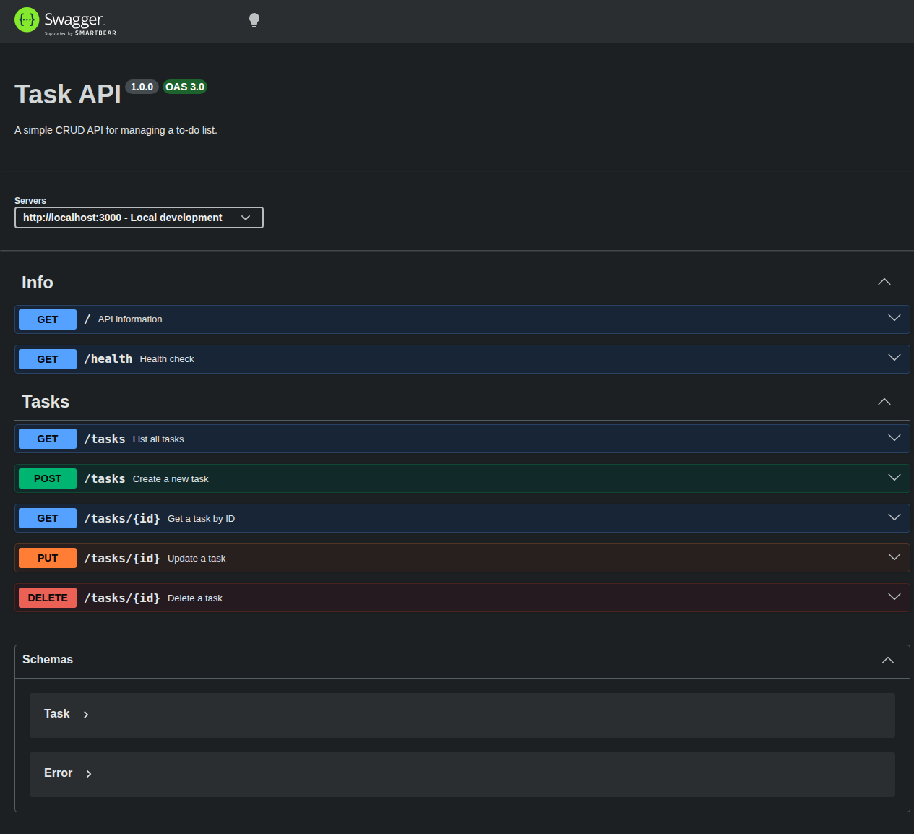

# Task API

A simple CRUD API for managing a to-do list. Built with Express and TypeScript as part of the FlyRank Backend Internship (Week 2, Assignment A1).

## How to run

```bash
# From the repository root
npm install
npx tsx week-2/BE-01/server.ts
```

The server starts at **http://localhost:3000**.

## Endpoints

| Method | Path | Description | Status codes |
|--------|------|-------------|--------------|
| GET | `/` | API information | 200 |
| GET | `/health` | Health check | 200 |
| GET | `/tasks` | List all tasks | 200 |
| GET | `/tasks/{id}` | Get a single task | 200, 404 |
| POST | `/tasks` | Create a new task | 201, 400 |
| PUT | `/tasks/{id}` | Update a task | 200, 400, 404 |
| DELETE | `/tasks/{id}` | Delete a task | 204, 404 |

All error responses return JSON: `{ "error": "message" }`.

## Example

```bash
curl -i http://localhost:3000/tasks/
```

```http
HTTP/1.1 200 OK
Content-Type: application/json

[
  { "id": 1, "title": "Learn Express basics", "done": true },
  { "id": 2, "title": "Build a CRUD API", "done": false },
  { "id": 3, "title": "Write documentation", "done": false }
]
```

## Swagger UI

Interactive API documentation at **http://localhost:3000/docs** — try every endpoint with the "Try it out" button.



## Data

Tasks are stored in memory. Restarting the server resets the data to the three default tasks. No database is used — that comes in Week 3.

## Tech stack

- **Runtime:** Node.js
- **Framework:** Express
- **Language:** TypeScript (via tsx)
