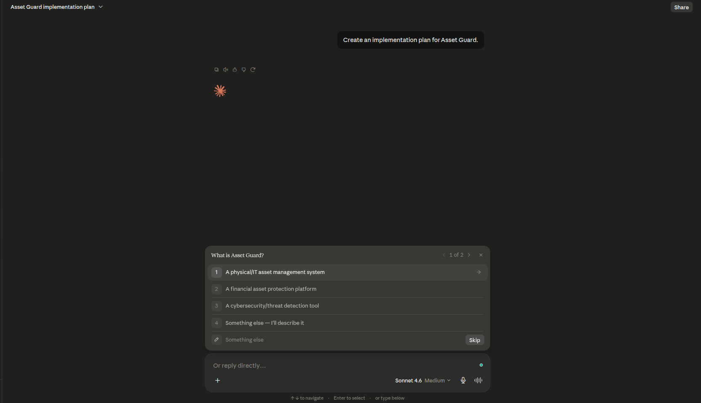
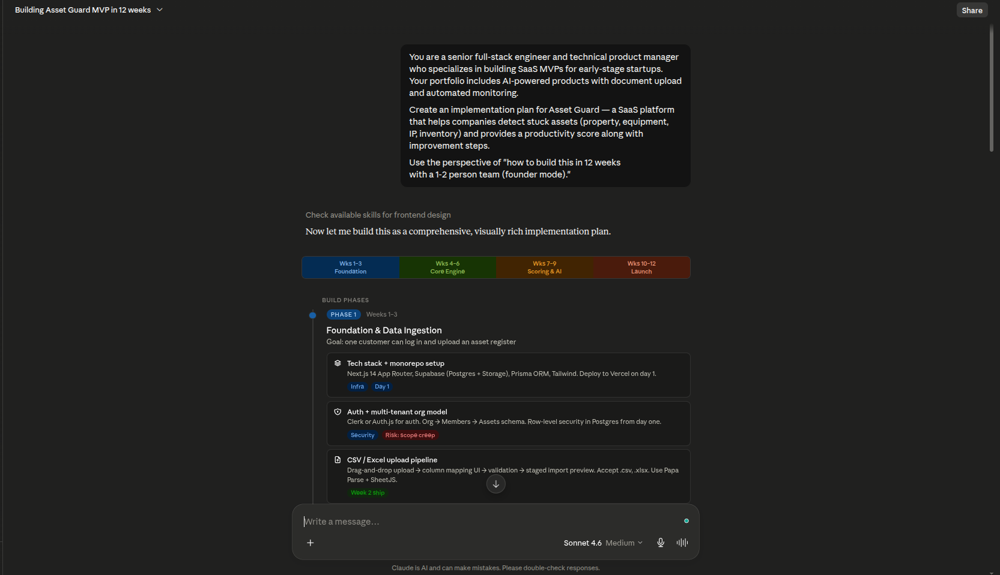
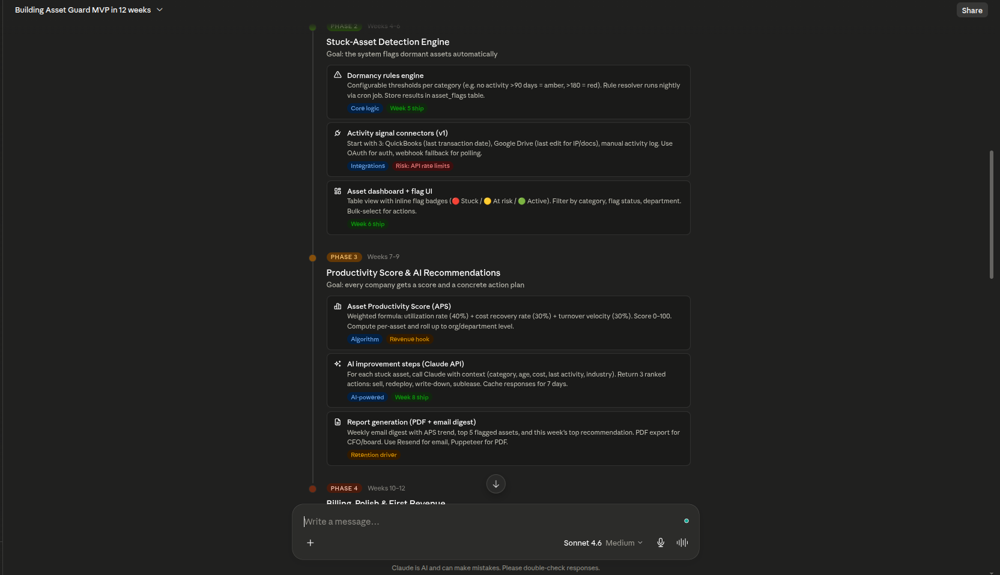
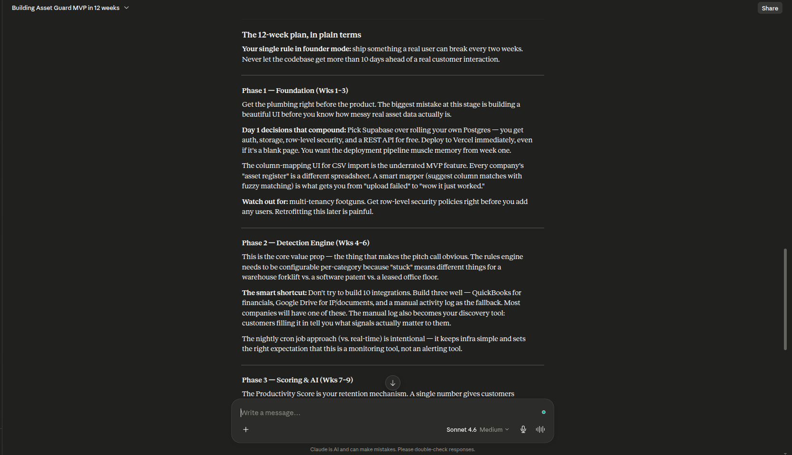
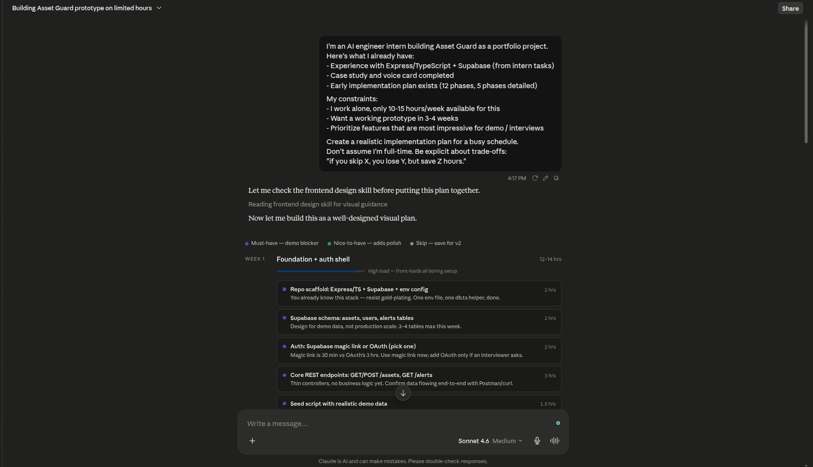
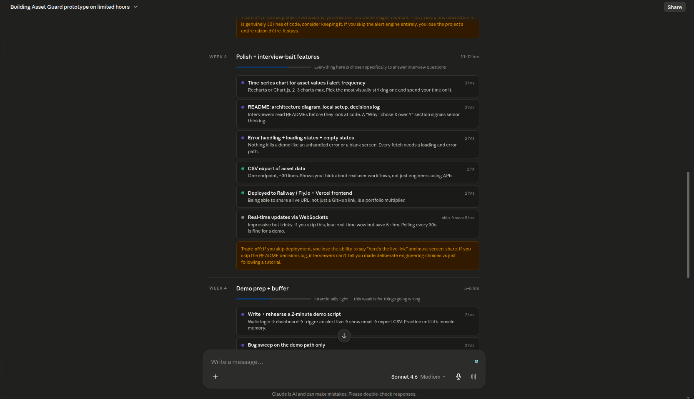
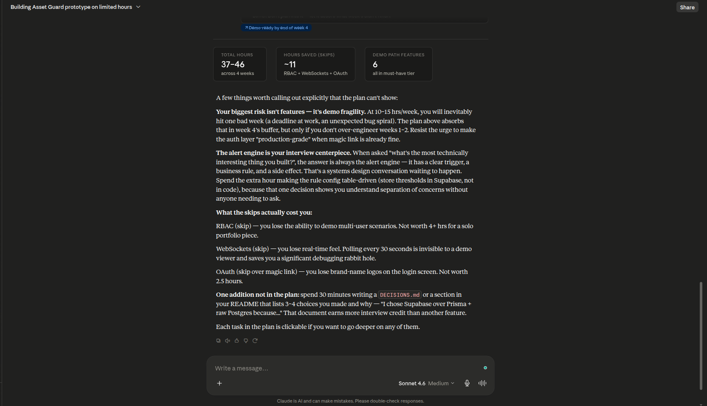
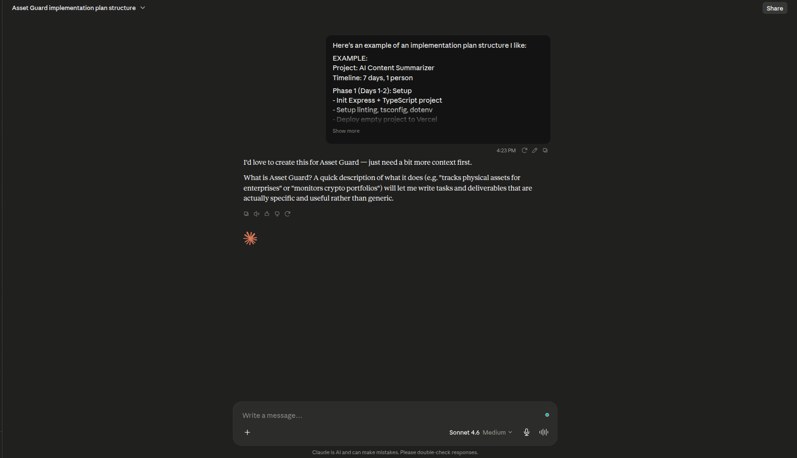
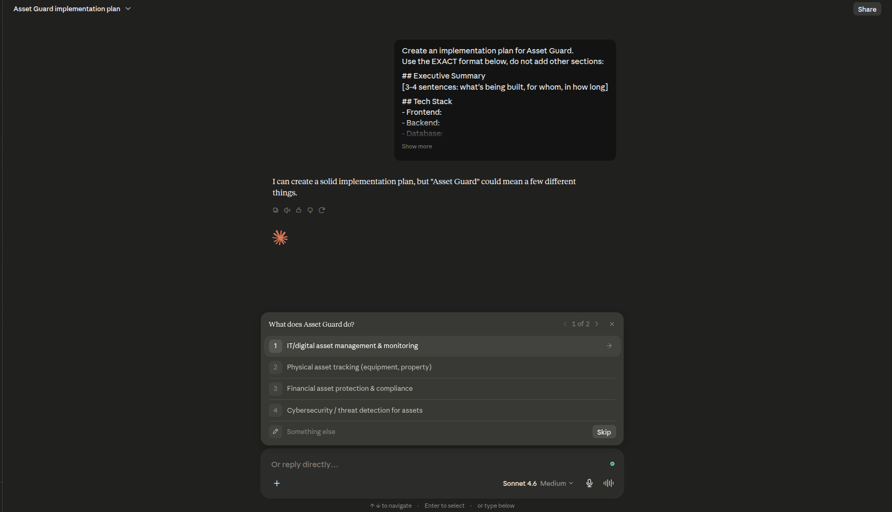
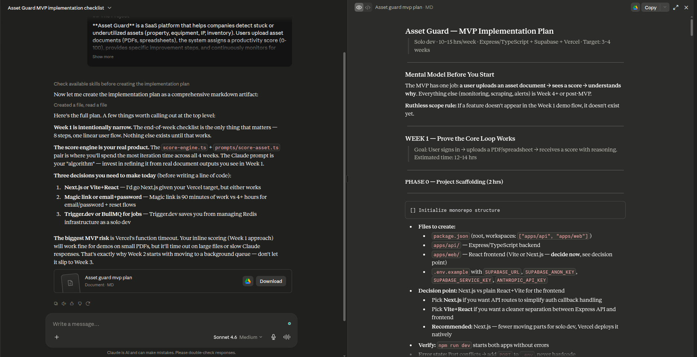

# FL-02: Prompt Iteration Log — Asset Guard

**Target Task:** Plan Building — break down Asset Guard idea into actionable implementation steps
**Source:** FL-01 Table 2 #2 (Collaborate with AI)

---

## V1 — Naive Prompt

Run this prompt on Claude. Paste the output below.

```text
Create an implementation plan for Asset Guard.
```

**Claude Output:**

Claude did not produce a plan. Instead, it asked clarifying questions — it wanted to know the project's purpose, target users, timeline, and tech stack before proceeding. The prompt was too vague to act on.

<div align="center">
  
</div>

**Notes (what's missing / too generic):**
- No goal stated → Claude can't scope the output
- No target audience → Claude doesn't know level of detail needed
- No constraints → Claude defaults to generic startup advice
- Lesson: a naive prompt without context shifts the thinking work to the AI asking questions instead of delivering


---

## V2 — Role Assignment

Run this prompt on Claude. Paste the output below.

```text
You are a senior full-stack engineer and technical product manager
who specializes in building SaaS MVPs for early-stage startups.
Your portfolio includes AI-powered products with document upload
and automated monitoring.

Create an implementation plan for Asset Guard — a SaaS platform
that helps companies detect stuck assets (property, equipment,
IP, inventory) and provides a productivity score along with
improvement steps.

Use the perspective of "how to build this in 12 weeks
with a 1-2 person team (founder mode)."
```

**Claude Output:**

> **Phase 1 — Foundation (Wks 1–3)** — Get the plumbing right. Pick Supabase, deploy to Vercel immediately. Column-mapping UI for CSV import is the underrated MVP feature. Watch out for multi-tenancy RLS footguns.
>
> **Phase 2 — Detection Engine (Wks 4–6)** — Build 3 integrations well (QuickBooks, Google Drive, manual activity log). Nightly cron jobs keep infra simple.
>
> **Phase 3 — Scoring & AI (Wks 7–9)** — Productivity Score is the retention mechanism. Start simple (utilization × cost recovery × turnover velocity). AI recommendations must be actionable within 30 days.
>
> **Phase 4 — Billing & Launch (Wks 10–12)** — $149 Growth tier as primary target. 5 design partners > ProductHunt spike. Founder-led cold outreach to CFOs/VP Ops.

<div style="display: flex; gap: 8px;">
  
  
  
</div>

**What changed from V1?**
- V1 got clarifying questions — V2 got a full structured plan with phases, timelines, and concrete advice
- Role assignment gave Claude a lens to scope the answer (founder-mode, 12-week horizon)
- The output includes *what not to build* — explicit anti-scope that V1 couldn't produce
- Still lacks awareness of my personal constraints (part-time, solo) — treats "founder" as full-time


---

## V3 — Context & Motivation

Run this prompt on Claude. Paste the output below.

```text
I'm an AI engineer intern building Asset Guard as a portfolio project.
Here's what I already have:
- Experience with Express/TypeScript + Supabase (from intern tasks)
- Case study and voice card completed
- Early implementation plan exists (12 phases, 5 phases detailed)

My constraints:
- I work alone, only 10-15 hours/week available for this
- Want a working prototype in 3-4 weeks
- Prioritize features that are most impressive for demo / interviews

Create a realistic implementation plan for a busy schedule.
Don't assume I'm full-time. Be explicit about trade-offs:
"if you skip X, you lose Y, but save Z hours."
```

**Claude Output:**

> **Biggest risk isn't features — it's demo fragility.** At 10–15 hrs/week, one bad week can derail you. The plan absorbs that in a buffer week, but only if you don't over-engineer weeks 1–2.
>
> **The alert engine is your interview centerpiece.** When asked "what's the most technically interesting thing you built?" — the answer is the alert engine. Make the rule config table-driven (store thresholds in Supabase, not in code).
>
> **What the skips actually cost you:**
> - RBAC → lose multi-user demo. Not worth 4+ hrs.
> - WebSockets → lose real-time feel. Polling every 30s is invisible to a demo viewer.
> - OAuth → lose brand logos on login. Not worth 2.5 hrs.
>
> **One addition:** spend 30 min writing a `DECISIONS.md` listing 3-4 choices and why. That document earns more interview credit than another feature.

<div style="display: flex; gap: 8px;">
  
  
  
</div>

**What changed from V2?**
- Now addresses *my* constraints (10-15 hrs/wk, solo, portfolio goal) — V2 treated "founder" as full-time
- Explicit trade-offs with hour costs ("skip X, lose Y, save Z hrs") — exactly what the prompt asked for
- Practical advice beyond code: `DECISIONS.md` for interviews, demo fragility as a risk
- Output is more tailored — not generic startup advice but specific to a solo intern building for portfolio


---

## V4 — Few-shot Examples

Run this prompt on Claude. Paste the output below.

```text
Here's an example of an implementation plan structure I like:

EXAMPLE:
Project: AI Content Summarizer
Timeline: 7 days, 1 person

Phase 1 (Days 1-2): Setup
- Init Express + TypeScript project
- Setup linting, tsconfig, dotenv
- Deploy empty project to Vercel
- Deliverable: Server running at production URL

Phase 2 (Days 3-5): Core Logic
- POST /summarize endpoint
- Integrate OpenAI API, handle streaming
- Error handling for rate limits and timeouts
- Deliverable: API returns summary successfully

Phase 3 (Days 6-7): Frontend
- Minimal HTML page with input URL
- Display summary with typing effect
- Deliverable: User can input URL and see summary

---

NOW create the SAME structure for Asset Guard.
Use this format:
- Phase (day/week range)
- 3-5 bullet tasks per phase
- One Deliverable per phase (verifiable statement: "User can X")
- Focus on phases achievable in the first 3-4 weeks (not 12 weeks)
```

**Claude Output:**

Claude still asked clarifying questions — it didn't know what Asset Guard is. The few-shot example gave it the *format* but without a project description in the prompt, it couldn't produce a specific plan.

> *"Just need a bit more context first. What is Asset Guard? A quick description of what it does will let me write tasks and deliverables that are actually specific and useful rather than generic."*

This reveals: a few-shot example teaches structure, but if the model doesn't understand the project itself, it won't risk guessing wrong.

<div align="center">
  
</div>

**What changed from V3?**
- V3 (context + motivation) gave Claude enough to produce tailored advice
- V4 removed that context in favor of a few-shot example — and Claude stalled
- Key insight: few-shot works **only after** the model understands what it's working on. Structure without context = questions, not output
- The few-shot did succeed in one way: Claude wanted to match the example format, it just needed the raw material first


---

## V5 — Output Structure

Run this prompt on Claude. Paste the output below.

```text
Create an implementation plan for Asset Guard.
Use the EXACT format below, do not add other sections:

## Executive Summary
[3-4 sentences: what's being built, for whom, in how long]

## Tech Stack
- Frontend:
- Backend:
- Database:
- Storage:
- Deployment:
- AI/API:

## Implementation Phases (focus on first 3-4 weeks)
| Phase | Week | Key Tasks | Deliverable | Est. Hours |
|-------|------|-----------|-------------|------------|
| 1 | 1 | ... | ... | ... |
| 2 | 2 | ... | ... | ... |
| 3 | 3-4 | ... | ... | ... |

## Key Milestones
- Week 1:
- Week 2:
- Week 3-4 (MVP):

## Feature Priority
- MVP (weeks 1-4):
- Post-MVP:

## Top-3 Risks
1. [Risk]: [Mitigation]
2. [Risk]: [Mitigation]
3. [Risk]: [Mitigation]
```

**Claude Output:**

Once again, Claude asked for clarification — same pattern as V4. Without a description of what Asset Guard is, the rigid format alone doesn't give the model enough to produce a plan.

> *"I can create a solid implementation plan, but 'Asset Guard' could mean a few different things."*

**Pattern confirmed:** V4 (few-shot) and V5 (output structure) both stalled because neither included a project description. The output format is useless if the model doesn't know what it's formatting.

<div align="center">
  
</div>

**What changed from V4?**
- Same failure mode — both lacked project context
- The format request itself is fine, but it needs to sit on top of context, not replace it
- **Key lesson:** techniques are additive. Starting fresh with a new technique each time loses the ground gained in earlier versions. A real workflow would combine context (V3) + structure (V5) + decomposition (V6)


---

## V6 — Step Decomposition

Run this prompt on Claude. Paste the output below.

```text
You are a senior full-stack engineer building SaaS MVPs. Your specialty is breaking down complex products into bite-sized coding tasks that a solo developer can execute.

## The Project

**Asset Guard** is a SaaS platform that helps companies detect stuck or underutilized assets (property, equipment, IP, inventory). Users upload asset documents (PDFs, spreadsheets), the system assigns a productivity score (0-100), provides specific improvement steps, and continuously monitors for new opportunities or risks via automated web scraping.

## My Context

- Solo developer, 10-15 hours/week available
- Stack: Express/TypeScript, Supabase (auth, Postgres, storage), Vercel deployment
- Goal: working prototype in 3-4 weeks, impressive for demo/interviews
- Already done: case study, voice card, conceptual implementation plan

## Your Task

Create a step-by-step implementation plan using STRICT CHECKLIST format. Focus on the first 3-4 weeks (MVP).

For EACH phase, break down every step with:

1. **File/component** — exact file names and their responsibility
2. **Decision point** — architecture choices I need to make before coding
3. **Verification** — how to confirm it works (specific test or check)
4. **Error state** — what can go wrong and how to handle it
5. **Dependency** — what must be done before this step

Example format:
[] Create src/routes/assets.ts
  → POST /assets handler — validate input, insert to Supabase, return 201
  → Edge case: missing required fields → return 400 with field list
  → Edge case: duplicate asset name per user → return 409
  → Verify: curl -X POST /assets -d '{...}' → expect 201 + asset_id
  → Depends on: Supabase client setup, assets table migration

[] Create src/lib/score-engine.ts
  → Function: calculateScore(asset) — weighted formula per category
  → Edge case: missing financial data → default to 50 (needs review)
  → Verify: unit test with known inputs → expect correct score
  → Depends on: asset schema finalized

Start with the absolute MVP — what's the smallest thing I can ship
in week 1 that proves a user can upload an asset and see a score?
```


**Claude Output:**

For the first time, Claude produced a complete, production-ready implementation plan — 4 weeks of phased tasks with exact file names, SQL schemas, TypeScript interfaces, prompt templates, edge case handling, and an end-of-week checklist.

**Highlights:**
- **Week 1** — Narrow linear flow: auth → upload → parse → score → display. 8-step checklist defines "done."
- **Score engine** is identified as "your real product" — the Claude prompt *is* the algorithm.
- **3 decisions to make before writing code:** Next.js vs Vite, magic link vs email/password, Trigger.dev vs BullMQ.
- **Biggest MVP risk flagged:** Vercel function timeout on large files — Week 2 moves scoring to a background queue.
- Every step includes: file name → responsibility → verification test → error state → dependency.

Full plan downloaded to `data/asset-guard-mvp-plan.md` (769 lines).

<div align="center">
  
</div>

**What changed from V5?**
- V5 stalled (no project context) — V6 delivered the most complete output across all 6 versions
- Combination of role + context + structure + decomposition produced something immediately actionable
- First version to include runnable SQL migrations, TypeScript interfaces, and prompt templates
- The "end-of-week checklist" pattern (from few-shot example) appeared naturally without being forced


---

## Conclusion

### What This Iteration Taught Me

Running 6 prompt versions on the same task revealed a clear pattern:

| # | Technique | Included project context? | Outcome |
|---|-----------|--------------------------|---------|
| V1 | Naive | ❌ | Clarifying questions |
| V2 | Role Assignment | ✅ (project desc in role) | 12-week plan with phases |
| V3 | Context & Motivation | ✅ (personal constraints) | Tailored plan with trade-offs |
| V4 | Few-shot Examples | ❌ | Clarifying questions |
| V5 | Output Structure | ❌ | Clarifying questions |
| V6 | Step Decomposition | ✅ (role + context + structure) | Full production-ready plan |

### Key Takeaways

1. **Context is not optional.** Every version that included a project description produced useful output. Every version that skipped it stalled.

2. **Techniques are additive, not replacements.** The best result (V6) combined role assignment + context + output structure + step decomposition. Isolated techniques failed where combinations succeeded.

3. **The naive prompt is a valid baseline.** V1 showed exactly what "zero engineering" looks like — and every subsequent version demonstrated measurable improvement.

4. **Few-shot only works after context.** V4 proved that an example format without project understanding just generates more questions. The few-shot example *structure* was useful (V6's checklist format came from it), but only after the model knew what Asset Guard was.

### The Final Prompt Template

The reusable template below distills what worked:

```text
You are [ROLE — e.g., senior engineer building SaaS MVPs].

I need a [DELIVERABLE — e.g., implementation plan] for [PROJECT — 1-line description].

## The Project
[2-3 sentence description of what it does, who it's for, and the core value]

## My Context
- Background: [your skills / stack / constraints]
- Time available: [hours per week]
- Goal: [what success looks like]
- Already done: [what exists so far]

## Your Task
Create a [DELIVERABLE] using [FORMAT — e.g., strict checklist format].
Focus on the first [N] weeks (MVP).

For EACH step, break down:
1. File/component — exact names and responsibility
2. Decision point — architecture choices to make before coding
3. Verification — how to confirm it works
4. Error state — what can go wrong and how to handle it
5. Dependency — what must be done before this step

Example of the format I want:
[CONCRETE EXAMPLE with file names, edge cases, and verification steps]

Start with the smallest thing I can ship that proves the core loop works.
```

### Deliverable

- Prompt iteration log: `README.md` (this file)
- Full implementation plan: [`data/asset-guard-mvp-plan.md`](data/asset-guard-mvp-plan.md) (769 lines)
- 11 screenshots documenting each prompt's output
