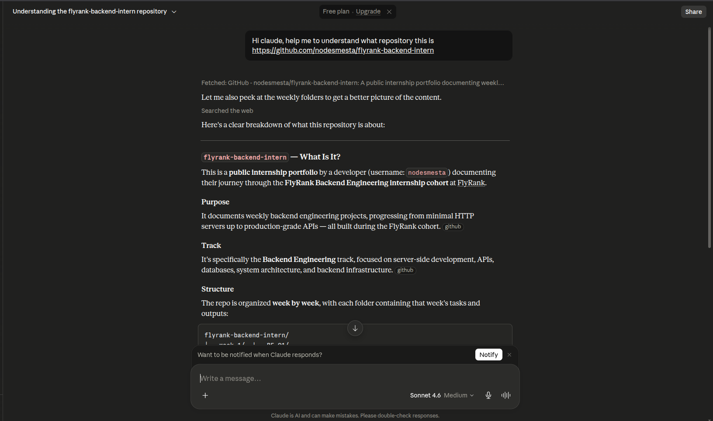
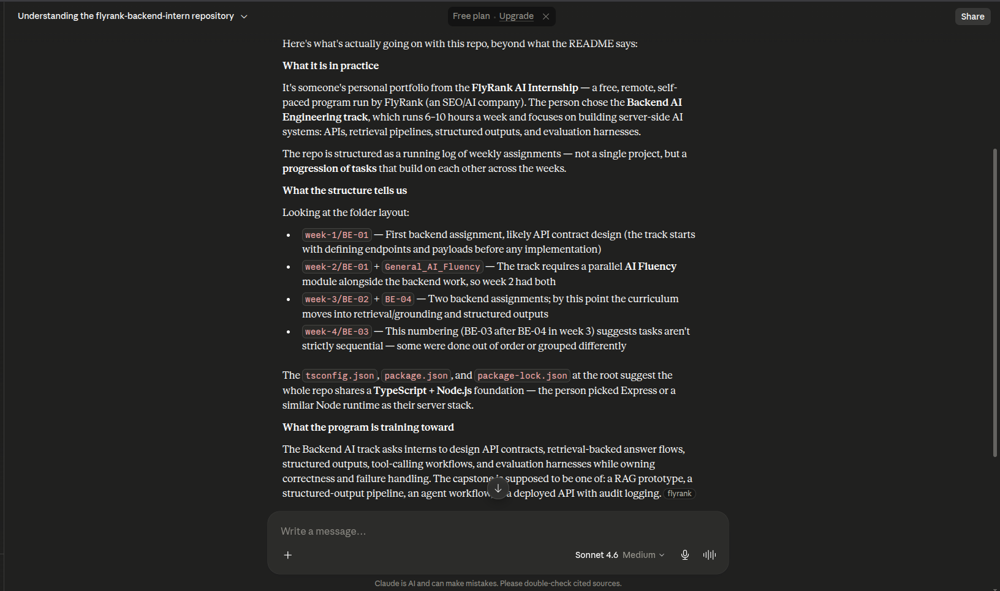
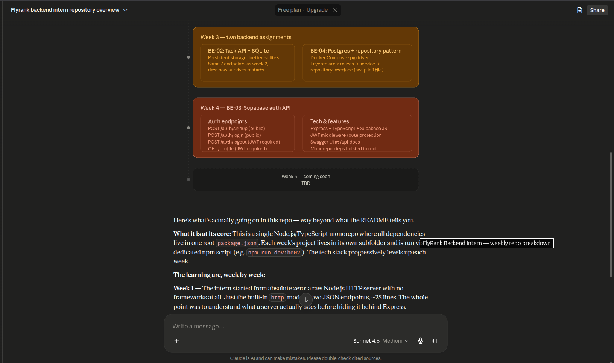
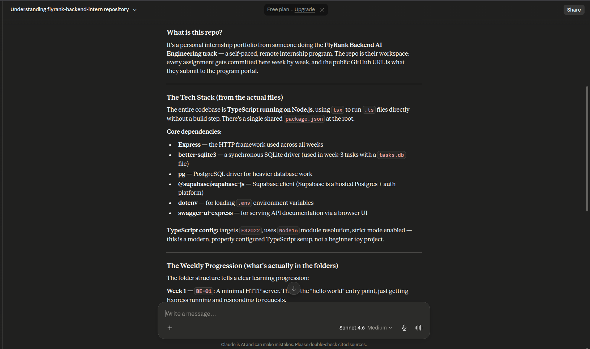
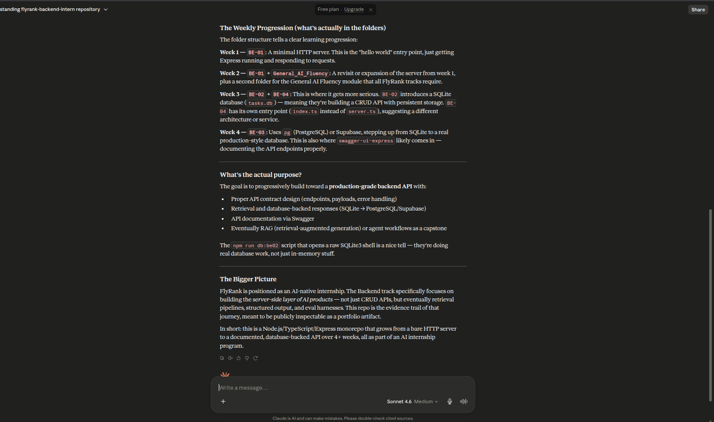
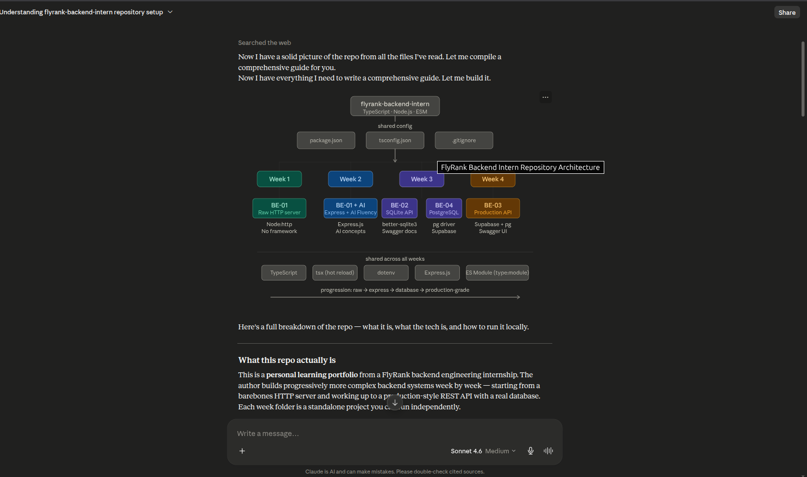
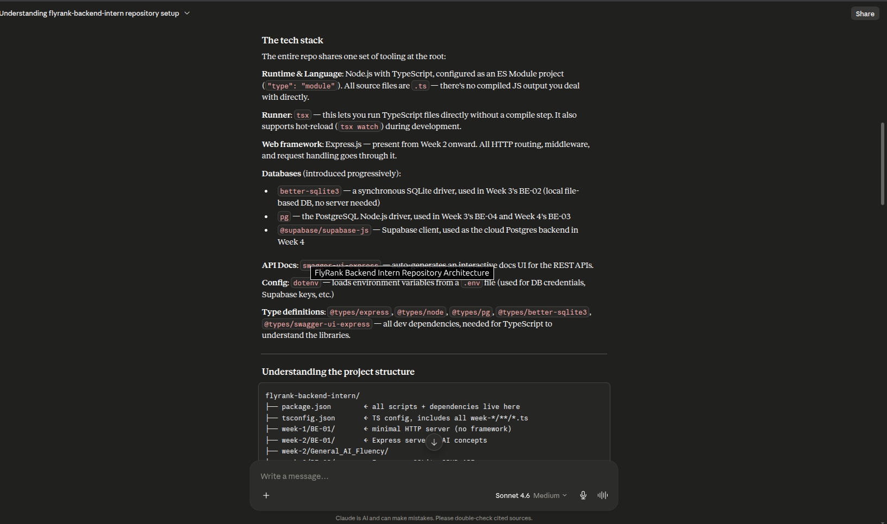
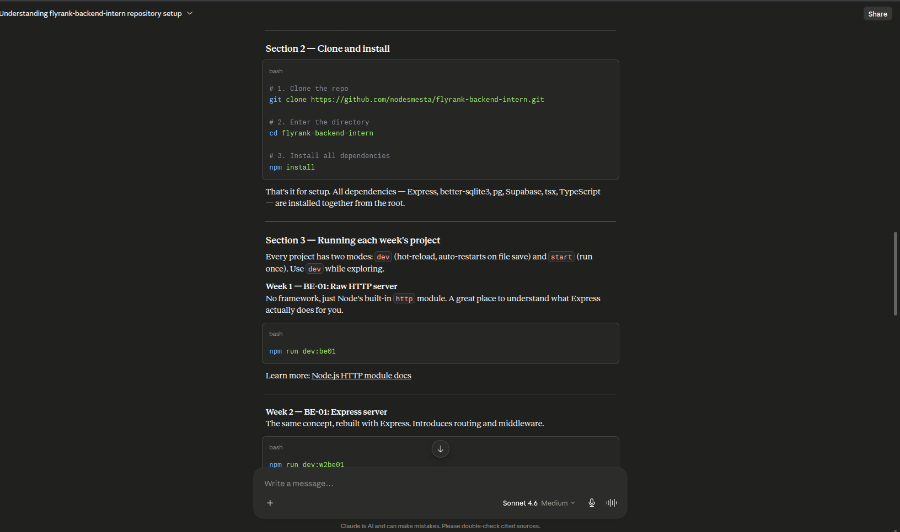
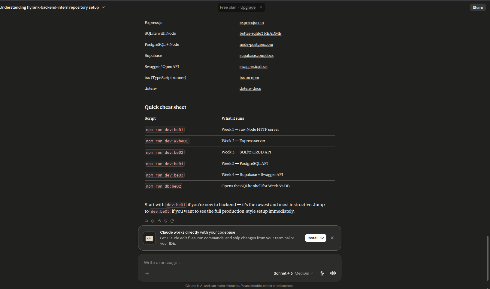

# Prompt Ladder - General AI Fluency Track

## Summary

I will use the Workspace repository [Flyrank-intern](https://github.com/nodesmesta/flyrank-backend-intern) (I will act as an ordinary person who does not understand what this repository was created for). I will start from where I began prompting as a layperson and try to evaluate ways to produce better information. The goal is to identify what mistakes I often make when looking at a workspace I do not understand beforehand.

**Tools used:** `web_search`
**LLM Model:** Claude Sonnet 4.6

## Prompt I (Baseline Prompt)

**Prompt:** Hi claude, help me to understand what repository this is `Link repo`

**Result:**

**Review:** The result was generic. Claude only moved the README content.

## Prompt II (Evaluation I)

**Prompt:** Hi claude, help me to understand what repository this is `Link repo` do not only move the information from README here

**Result:**

**Review:** The result was still generic. Claude tried to inspect the structure and convey its contents (This was a context limitation due to the tools used `web_search`).

## Prompt III (Evaluation II)

**Prompt:** Hi claude, help me to understand what repository this is `Link repo` do not only move the information from README here

**Result:**

**Review:** The result was still generic. Claude tried to inspect the structure and convey its contents (This was a context limitation due to the tools used `web_search`).

## Prompt IV (Evaluation III)

**Prompt:** Hi claude, help me to understand what repository this is https://github.com/nodesmesta/flyrank-backend-intern dont only move the information from README here.
Lets spesifik what in folder in every week.

**Result:**

**Review:** This is starting to get interesting. During the process, `web_search` reached its limit, Claude tried using `fetch`. Claude provided a visual output of items per-week with simple explanations.

## Prompt V (Evaluation IV)

**Prompt:** Hi claude, help me to understand what repository this is https://github.com/nodesmesta/flyrank-backend-intern dont only move the information from README here.

you should understand the file on repo properly.  give me understand like what the tech on this repo and what the purpose of this repository.

**Result:**

**Review:** Claude provided very valuable information. The output information was well-organized and comprehensive.

## Prompt VI (Evaluation V)

**Prompt:** Hi claude, help me to understand what repository this is https://github.com/nodesmesta/flyrank-backend-intern dont only move the information from README here.

you should understand the file on repo properly.  give me understand like what the tech on this repo and what the purpose of this repository.

**Result:**

**Review:** Claude provided very valuable information. The output information was well-organized and comprehensive.

## Conclution

Prompting ladder teaches us that, as humans, AI can indeed provide information, but is that enough?

AI will produce information according to the input prompt from humans. Of course, we must know what we want to do with AI. Change from asking to briefing.

This experiment file (From Prompt1 to Prompt5) we can conclude that: for the same purpose, with different prompts, claude will produce better, structured and systematic information. of course we can distinguish which one will make our work easier in the future as an AI engineer.
