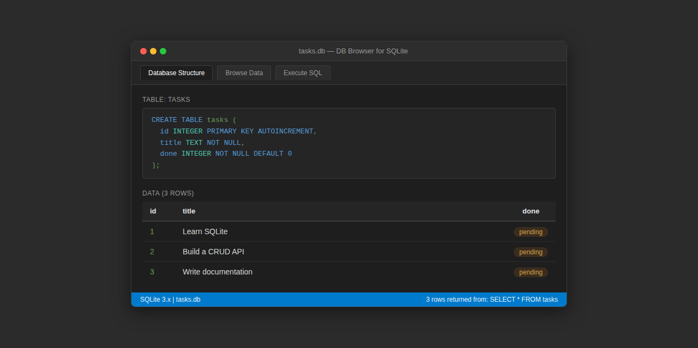

# Task API — SQLite

A simple CRUD API for managing a to-do list, backed by SQLite for persistent storage. Built with Express and TypeScript as part of the FlyRank Backend Internship (Week 3, Assignment A2).

In-memory storage from Week 2 is replaced with a SQLite database — same endpoints, same responses, but data now survives a restart.

## Why SQLite?

- **Zero setup** — no database server to install or configure. SQLite reads and writes a single file on disk.
- **Portable** — the entire database lives in `tasks.db`. Copy it, back it up, delete it — no side effects.
- **Persistent** — data is written to disk immediately. Restart the server and everything is still there.

## How to run

```bash
# From the repository root
npm install
npm run start:be02
```

The server starts at **http://localhost:3000**. The database file `week-3/BE-02/tasks.db` is created automatically on first run, seeded with three sample tasks.

Open the database directly from anywhere in the project:

```bash
npm run db:be02
```

## Database

| Item | Detail |
|------|--------|
| **File** | `week-3/BE-02/tasks.db` (gitignored — each clone starts fresh) |
| **Engine** | SQLite via better-sqlite3 |
| **Table** | `tasks` |
| **Columns** | `id` (INTEGER PRIMARY KEY AUTOINCREMENT), `title` (TEXT NOT NULL), `done` (INTEGER DEFAULT 0) |
| **Seed data** | 3 tasks inserted only when the table is empty — safe to restart without duplication |

## Endpoints

| Method | Path | Description | Status codes |
|--------|------|-------------|--------------|
| GET | `/tasks` | List all tasks | 200 |
| GET | `/tasks/{id}` | Get a single task | 200, 404 |
| POST | `/tasks` | Create a new task | 201, 400 |
| PUT | `/tasks/{id}` | Update a task | 200, 400, 404 |
| DELETE | `/tasks/{id}` | Delete a task | 204, 404 |

All error responses return JSON: `{ "error": "message" }`.

## Examples

**List all tasks**

```bash
curl -i http://localhost:3000/tasks
```

```http
HTTP/1.1 200 OK
Content-Type: application/json

[
  { "id": 1, "title": "Learn SQLite", "done": 0 },
  { "id": 2, "title": "Build a CRUD API", "done": 0 },
  { "id": 3, "title": "Write documentation", "done": 0 }
]
```

**Create a task**

```bash
curl -i -X POST http://localhost:3000/tasks \
  -H "Content-Type: application/json" \
  -d '{"title": "Buy groceries"}'
```

```http
HTTP/1.1 201 Created
Content-Type: application/json

{ "id": 4, "title": "Buy groceries", "done": 0 }
```

**Update a task (mark as done)**

```bash
curl -i -X PUT http://localhost:3000/tasks/1 \
  -H "Content-Type: application/json" \
  -d '{"title": "Learn SQLite", "done": true}'
```

```http
HTTP/1.1 200 OK
Content-Type: application/json

{ "id": 1, "title": "Learn SQLite", "done": 1 }
```

**Delete a task**

```bash
curl -i -X DELETE http://localhost:3000/tasks/4
```

```http
HTTP/1.1 204 No Content
```

**Error — task not found**

```bash
curl -i http://localhost:3000/tasks/999
```

```http
HTTP/1.1 404 Not Found
Content-Type: application/json

{ "error": "Task not found" }
```

**Error — missing title**

```bash
curl -i -X POST http://localhost:3000/tasks \
  -H "Content-Type: application/json" \
  -d '{}'
```

```http
HTTP/1.1 400 Bad Request
Content-Type: application/json

{ "error": "title is required" }
```

## SQL Queries

You can inspect and manipulate the database directly using the `sqlite3` CLI:

```bash
# From anywhere in the project (no need to cd to the db folder)
npm run db:be02
```

```sql
-- List every task
SELECT * FROM tasks;

-- Only completed tasks
SELECT * FROM tasks WHERE done = 1;

-- How many tasks are there
SELECT COUNT(*) FROM tasks;

-- Mark every task completed
UPDATE tasks SET done = 1;

-- Delete all completed tasks
DELETE FROM tasks WHERE done = 1;
```

Changes made directly via SQL are immediately visible through the API — both read the same file.

## Screenshot



*Install [DB Browser for SQLite](https://sqlitebrowser.org) to view and edit the database visually. The screenshot above shows the `tasks` table with seeded data.*

## Data

Tasks are stored in a local SQLite database (`week-3/BE-02/tasks.db`). Unlike the in-memory version in Week 2, all data persists across restarts. The three seed tasks are inserted only when the table is empty — no duplicates on restart.

## Tech stack

- **Runtime:** Node.js
- **Framework:** Express
- **Database:** SQLite (via better-sqlite3)
- **Language:** TypeScript (via tsx)
