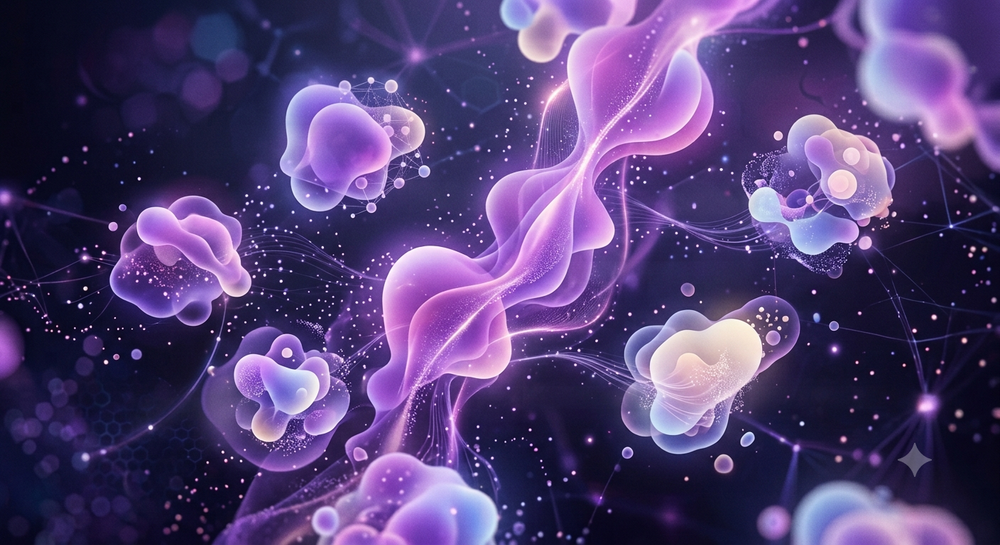
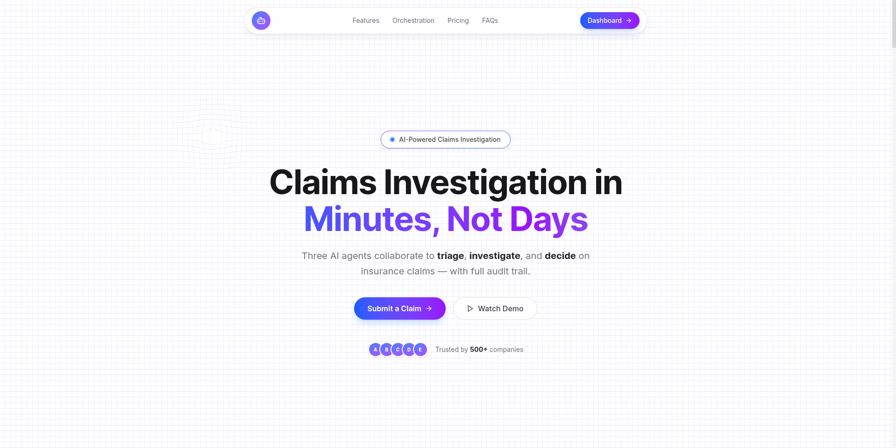

# Currate Your Images

**Deliverable:** The final image set (the keepers), the short note on what you rejected and why, and where you chose a real capture over AI.

---

## 1. Final Set — The Keepers

### Hero

  

**Page:** Hero section
**Type:** AI-generated
**Rationale:** Abstract data visualization — floating geometric shapes, purple gradient (#8511DF → #E8D5F5), no text. Atmospheric connective tissue that supports the headline without competing. Style matches the Identity Kit mood.

---

### Consumer Say

  

**Page:** Consumer Say / Testimonials
**Type:** Real capture
**Rationale:** Screenshot of a Three.js interactive testimonial grid. A static AI image can't meaningfully represent interactive state — real capture shows actual implementation.

---

### Logo

  

**Page:** Navbar / Footer
**Type:** Real — personal image (nodesemesta)

---

### Pending Items
| Item | Page | Type | Status |
|------|------|------|--------|
| Personal photo | About | Real | Need to take and upload |
| CTA illustration | CTA | AI-generated | Still thinking through the composition |

## 2. Where I Chose Real Over AI

| Image | Call | Why |
|-------|------|------|
| Consumer Say | **Real** | Three.js interactive grid — static AI can't represent behavior |
| Logo | **Real** | Personal branding image (nodesemesta) |
| Hero | **AI** | Abstract atmospheric tissue — not a representation of built work |
| Personal photo | **Real** *(pending)* | Subject is me — must be a real photo |
| CTA illustration | **AI** *(pending)* | Illustration in kit colors — no built equivalent yet |

## 3. Rejection Notes

### hero1.png — Rejected

  

**Why:** Too much hallucinated text. The hero section already has its own headline and subheadline — putting text inside the image competes with the page copy and creates visual clutter. The hero image should be atmospheric support, not another message.

**Verdict:** Replaced by `hero.png` — clean abstract composition, zero text, same purple gradient palette.
