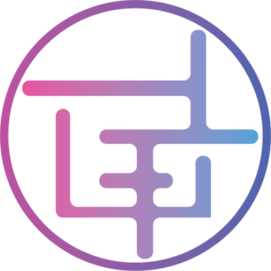

# Identity Kit

**Deliverable:** The identity kit on one page — fonts named, palette with hex codes, the logo/favicon, and the two-line style note.

---

## 1. Typography

| Role | Font Name | Weight(s) | Source |
|------|-----------|-----------|--------|
| Heading | Ubuntu | | Google Fonts |
| Body | Roboto Slab | | Google Fonts |

---

## 2. Color Palette

| Role | Hex Code |
|------|----------|
| Main color | `#8511DF` |
| Near-black text | `#1A1A2E` |
| Near-white background | `#F8F9FA` |
| Accent (max 1) | `#E8D5F5` |

---

## 3. Logo / Favicon



---

## 4. Style Note

```
Fonts: Ubuntu (headings), Roboto Slab (body)
Palette: #8511DF main, #1A1A2E text, #F8F9FA bg, #E8D5F5 accent
Mood: Warm and inviting — soft purple on clean white that feels like a space you want to stay in.
```

> **Save this in Claude Project → Project Instructions** so the build stays consistent.

---

## 5. Final Kit

```markdown
# Identity Kit

## Typography
- **Heading:** Ubuntu
- **Body:** Roboto Slab

## Palette
- Main: `#8511DF`
- Text: `#1A1A2E`
- Background: `#F8F9FA`
- Accent: `#E8D5F5`

## Logo


## Style Note
Fonts: Ubuntu (headings), Roboto Slab (body). Palette: #8511DF main, #1A1A2E text, #F8F9FA bg, #E8D5F5 accent. Warm and inviting — soft purple on clean white that feels like a space you want to stay in.
```
