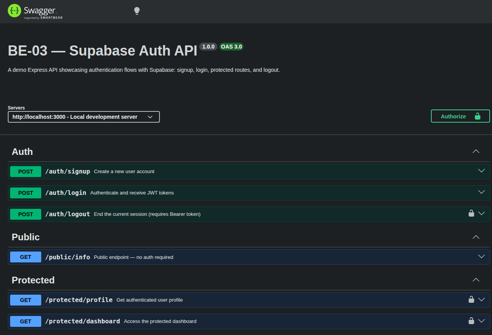

# BE-03 — Supabase Auth API (Express + TypeScript)

> FlyRank Internship — Backend Engineering Track | Week 4

A production-style Express API demonstrating **authentication flows with Supabase**: signup, login, JWT verification, middleware-based route protection, logout, and interactive API documentation via Swagger UI.

## 🚀 Quick Start

```bash
# 1. Clone repo (if not done) and install dependencies from root
npm install

# 2. Set up Supabase credentials
cp week-4/BE-03/.env.example week-4/BE-03/.env
# Edit week-4/BE-03/.env → fill in SUPABASE_URL and SUPABASE_KEY (anon/public key)

# 3. Start the server (run from root)
npm run dev:be03      # watch mode (auto-restart on changes)
# or
npm run start:be03    # one-shot
```

Server runs at **http://localhost:3000**

> **Note:** This project is part of a monorepo. All dependencies are hoisted to the root `package.json`. Do not run `npm install` inside `week-4/BE-03/`.

## 📡 API Reference

Interactive docs available at **http://localhost:3000/api-docs** (Swagger UI).

### Auth Endpoints

| Method | Path | Auth | Description |
|--------|------|------|-------------|
| `POST` | `/auth/signup` | ❌ | Create a new user account |
| `POST` | `/auth/login` | ❌ | Authenticate and receive JWT tokens |
| `POST` | `/auth/logout` | ✅ Bearer | End the current session |

### Public & Protected

| Method | Path | Auth | Description |
|--------|------|------|-------------|
| `GET` | `/public/info` | ❌ | Public welcome message |
| `GET` | `/protected/profile` | ✅ Bearer | Get authenticated user profile (id, email, created_at) |
| `GET` | `/protected/dashboard` | ✅ Bearer | Protected dashboard with user info |

### Example Flow

```bash
# 1. Sign up a new user
curl -X POST http://localhost:3000/auth/signup \
  -H "Content-Type: application/json" \
  -d '{"email":"user@example.com","password":"securePass123"}'

# 2. Log in to get tokens
curl -X POST http://localhost:3000/auth/login \
  -H "Content-Type: application/json" \
  -d '{"email":"user@example.com","password":"securePass123"}'
# → Returns access_token, refresh_token, and user object

# 3. Access a protected route
curl http://localhost:3000/protected/profile \
  -H "Authorization: Bearer <access_token>"

# 4. Log out
curl -X POST http://localhost:3000/auth/logout \
  -H "Authorization: Bearer <access_token>"
```

## 🏗 Project Structure

```
week-4/BE-03/
├── src/
│   ├── middleware/
│   │   └── auth.ts        # Auth middleware — reusable Bearer JWT guard
│   ├── server.ts          # Entry point — Express app with all routes
│   └── openapi.json       # OpenAPI 3.0 specification for Swagger UI
├── docs/screenshots/      # Reference screenshots
├── .env                   # Supabase credentials (git-ignored)
├── .env.example           # Environment variable template
├── .gitignore             # node_modules/, dist/, .env, *.log
├── README.md              # This documentation
└── W4 - Auth - Login & protect.pdf   # Assignment spec
```

## 🧠 Architecture & Stages

The API was built incrementally across 6 stages:

| Stage | What was built | Key concept |
|-------|----------------|-------------|
| **0** | Express + Supabase setup | Environment config, client initialization |
| **1** | `POST /auth/signup` & `POST /auth/login` | Supabase Auth SDK basics |
| **2** | `GET /public/info` & `GET /protected/profile` | Public vs protected route design |
| **3** | Token verification via `supabase.auth.getUser()` | Server-side JWT validation |
| **4** | `createAuthMiddleware()` factory + `POST /auth/logout` + `GET /protected/dashboard` | Reusable middleware separated into `src/middleware/auth.ts` — dependency injection pattern (passes Supabase client) |
| **5** | Swagger UI at `/api-docs` | Interactive API documentation with Bearer auth |
| **6** | `.env.example`, GitHub push, README | Project packaging and sharing |

## 🛠 Tech Stack

| Tool | Version |
|------|---------|
| Node.js | v22.22.3 |
| TypeScript | ^7.0.2 |
| Express | ^5.2.1 |
| @supabase/supabase-js | ^2.110.8 |
| swagger-ui-express | ^5.0.1 |
| tsx | ^4.23.1 |

## 🧪 Testing with curl

```bash
# Public endpoint
curl http://localhost:3000/public/info

# No auth → 401
curl http://localhost:3000/protected/profile

# Invalid token → 401
curl http://localhost:3000/protected/profile \
  -H "Authorization: Bearer invalid_token_here"
```

## 📸 Screenshots

### Swagger UI



### Protected Profile Response


