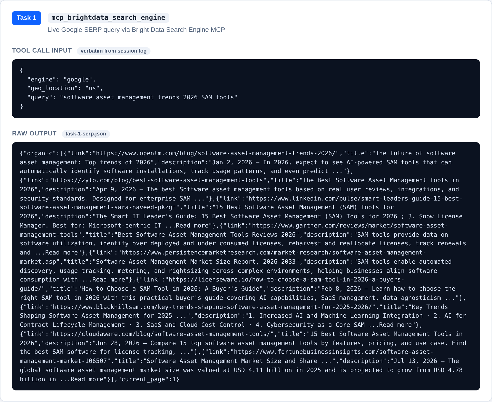
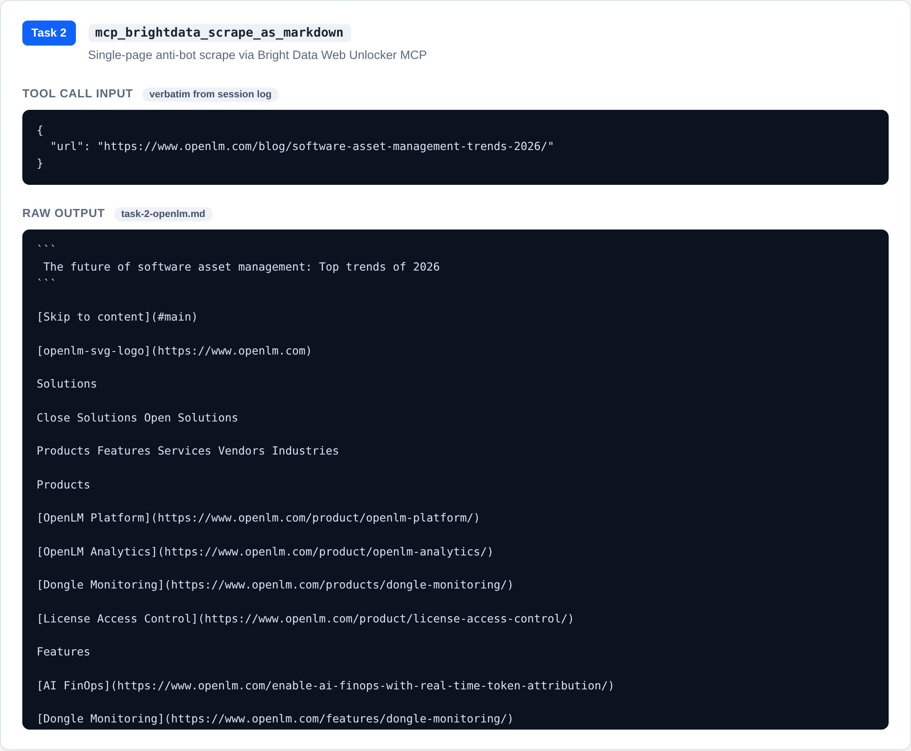
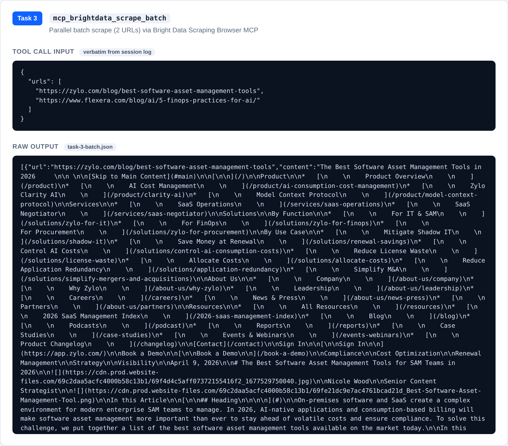

# FL-05 — Agent Concepts and MCP Basics

**Domain:** Asset Management SaaS (Asset Guard)
**Date:** August 1, 2026
**Client/Connector:** Hermes Agent (MCP client) + Bright Data MCP server

---

## What Was Done (Task at a Glance)

1. Read *Building Effective Agents* (Anthropic) and wrote the workflow-vs-agent
   distinction in my own words; classified the FL-04 pipeline.
2. Read the MCP introduction and explained the three primitives: **tools,
   resources, prompts**.
3. Connected one MCP server (Bright Data) to an MCP client (Hermes Agent) and
   ran **three tasks chat alone could not do** — live search, anti-bot page
   unlock, parallel batch scraping.
4. Wrote the 600–900 word explainer (below) and named **one concrete agent
   upgrade** for the FL-04 pipeline.

---

## Step 1 — Workflow vs Agent (and the FL-04 Verdict)

In my own words:

A **workflow** is a fixed sequence of steps. Every step is known in advance, the
order never changes, and the same input reliably produces the same output. The
orchestration lives in the code or the runbook, not in the model. If a step
fails, the workflow stops or a human picks a different path.

An **agent** is different in one crucial way: the model controls the loop. The
model decides *what to do next* based on the result of what it just did. It can
choose which tool to call, in what order, whether to retry, and when to stop.
The system is goal-directed, not step-directed: the human states the goal, and
the model works toward it by observing feedback from its own actions.

**Classification of the FL-04 pipeline: it is a workflow, not an agent.**

| Criterion | FL-04 reality |
| --- | --- |
| Step order | Fixed: Gather → Source (NotebookLM) → Synthesize → Save → Review |
| Who picks sources | The human, before the run (Gartner, HelloRetriever, Strev, …) |
| Who picks the tool call | The human — Bright Data calls were issued by me, not chosen by the model |
| Feedback loop | None — output does not feed back into the next decision |
| Self-correction | None — a bad NotebookLM insight requires a human re-run |
| Determinism | Deterministic: same sources + same prompt = same brief |

The pipeline is efficient and repeatable, but it has no model-driven control
flow. It executes a predefined recipe; it does not decide its own next move.

---

## Step 2 — The Three MCP Primitives

MCP (Model Context Protocol) is an open standard that connects AI models to
external tools and data — often described as a "USB-C port for AI." Instead of
building a bespoke integration for every tool, one protocol describes how a
client (the AI app) talks to a server (the tool or data source).

The three primitives, in my own words:

- **Tools** — actions the model can *invoke*: search the web, scrape a page,
  write a file, query an API. Tools are how an agent changes the world or
  fetches live data. Each tool has a name, a description, and a JSON schema for
  its arguments.
- **Resources** — data the server *exposes* to the model: files, database rows,
  API results. Resources are read-only context the model can pull in, similar
  to how a browser loads a page.
- **Prompts** — reusable instruction templates the server *offers*. A prompt
  packages a task (e.g., "summarize this pricing page") so the client can
  trigger a well-tested workflow instead of re-inventing the prompt each time.

In this assignment, the Bright Data MCP server contributed **tools**
(`search_engine`, `scrape_as_markdown`, `scrape_batch`) that the Hermes Agent
client invoked.

---

## Step 3 — Working MCP Setup: Three Tasks Chat Alone Could Not Do

The Bright Data MCP server is connected inside Hermes Agent. Three tool calls
were executed; transcripts are in `data/` and the raw outputs (verbatim from
the MCP responses) are in `data/raw/`.

**Task 1 — Live search engine query (SERP)**
`search_engine` → Google, geo `us`, query *"software asset management trends
2026 SAM tools"*. Returned 9 dated organic results (OpenLM, Zylo, Gartner,
IBM, market reports).
*Chat alone cannot:* a chat model has no live search access and cannot return
real, geo-targeted, bot-protected SERP results. Output:
[data/source-1-serp-results.md](data/source-1-serp-results.md)

  

**Task 2 — Single-page scrape with anti-bot unlock**
`scrape_as_markdown` → OpenLM article *"The future of software asset
management: Top trends of 2026"* (Jan 2, 2026). Full body extracted, including
FAQ. *Chat alone cannot:* the page requires rendering/unlocking; and the
article's content post-dates any training data. Output:
[data/source-2-openlm-trends-2026.md](data/source-2-openlm-trends-2026.md)

  

**Task 3 — Parallel batch scrape**
`scrape_batch` → Zylo *"Best Software Asset Management Tools 2026"* (Apr 9,
2026; 10 vendors + 2026 SaaS Management Index stats) and Flexera *"5 FinOps
practices you should apply to AI"* (Jul 30, 2026; same-week content).
*Chat alone cannot:* parallel multi-URL retrieval with per-URL anti-bot
handling. Outputs:
[data/source-3-zylo-best-sam-tools.md](data/source-3-zylo-best-sam-tools.md) ·
[data/source-4-flexera-finops-ai.md](data/source-4-flexera-finops-ai.md)

  

**Failed attempts (recorded honestly):**
- InvGate blog → navigation only (same failure as FL-04); replaced with OpenLM.
- ServiceNow blog URL → 404 dead link; replaced with Flexera.
- Full transcript of all calls: [data/prompts.md](data/prompts.md) ·
  [data/failure-points.md](data/failure-points.md)

**Screenshot provenance:** each screenshot above is a capture of
[data/evidence.html](data/evidence.html), which renders the **raw MCP output
itself** — every input and output block is embedded verbatim from the files in
`data/raw/`, extracted byte-for-byte from the Hermes session log
(`~/.hermes/sessions/session_20260801_161426_1affc2.json`). Nothing is
hand-written or summarized: the JSON shown is exactly what the Bright Data MCP
server returned (Task 1 and Task 3 are pure JSON; Task 2 is the raw markdown
response). PNG files: `data/task-1.png`, `data/task-2.png`, `data/task-3.png`.

---

## Step 4 — The Explainer (Deliverable)

### What an agent is

An agent is a system in which a language model sits inside a loop and controls
it. The model is given a goal and a set of tools, and it decides its own next
action by looking at the result of its previous action. It can call a search
tool, read the results, decide the results are not good enough, and call a
different tool. It can retry, change strategy, or stop when it judges the goal
is met. The important shift is control: in a script, the developer controls the
order of operations; in an agent, the model controls it at runtime. That is why
the Anthropic essay warns that the word "agent" is overloaded — many products
called agents are really fixed workflows wearing marketing language.

An agent needs three ingredients to be real. First, a model with enough
reasoning ability to choose between actions. Second, tools it can actually
invoke — without tools, an agent is just a chat model with a fancy name. Third,
a feedback loop: the model must see the outcome of its actions so it can adapt.
If any of these is missing, what you have is a workflow, not an agent.

### What MCP is

MCP is the plumbing that makes the second ingredient practical. Before MCP,
every tool integration was bespoke: one adapter for Slack, another for a
database, another for a scraping service. MCP standardizes this into a single
protocol with three primitives — tools (actions the model can invoke),
resources (data the model can read), and prompts (reusable task templates).
A server exposes its capabilities through the protocol, and any MCP-compatible
client can consume them. This is why it is called the "USB-C port for AI": one
connector shape works across many tools, and one client works across many
connectors. In this assignment, Bright Data is a server exposing search and
scraping tools; Hermes Agent is the client invoking them.

One sign that MCP is becoming a real integration standard rather than a
developer novelty is adoption inside our own domain. During Task 3, the Zylo
article's navigation included a dedicated Model Context Protocol product page
and a webinar about Zylo's own MCP connector. A vendor that manages software
assets for enterprises is exposing its platform through the same protocol this
assignment uses — a practical signal that MCP is where tool integrations for
the Asset Management SaaS space are heading.

### What the FL-04 workflow would need to become an agent

FL-04 is a five-step workflow: Gather (Bright Data), Source (NotebookLM),
Synthesize, Draft, and Review. It is a workflow because a human decides the
sources and the prompt before each run, the steps never change order, and the
output does not feed back into the next decision. To turn it into an agent,
four things are needed.

First, **model-driven control at the gather step**. Today I pick the sources
before the run. An agent would pick them: it could run the live search, notice
that the top result is a stale pricing page, and choose another source itself
— exactly the retry pattern demonstrated in Task 3 of this assignment.

Second, **tool access at decision points**. The Bright Data calls are currently
issued by a human operator. An agent would issue them itself through the MCP
server, choosing `search_engine` or `scrape_batch` based on what the brief
requires. The infrastructure for this already exists — this assignment ran
through it.

Third, **memory across runs**. An agent would remember that the InvGate blog
returns navigation only and skip it next time, or remember that NotebookLM
adds insights beyond the source and must be cross-checked. FL-04 logs these
lessons in a failure-points file; an agent would hold them in state and apply
them automatically.

Fourth, **self-evaluation before the human review step**. The final review
would become a loop: the agent drafts the brief, checks it against the brief's
own criteria (fresh sources, no hallucinated stats), and regenerates if it
fails — instead of shipping the first draft to a human.

---

## One Concrete Agent Upgrade for the FL-04 Pipeline

**Expose our own backend as an MCP server so the agent can close the loop.**

Our monorepo already ships Express APIs with `openapi.json` and
swagger-ui-express. The upgrade: wrap that OpenAPI surface in an MCP server
(tools = the API endpoints), then let the agent query its own internal state —
historical runs, saved briefs, which sources failed — and feed that state back
into the next gather step. The agent would then do what FL-04 cannot today:
decide its next action from its own past results, without a human in the loop.
This is a concrete, buildable next step on top of the exact infrastructure this
assignment used (client + MCP server + three working tool calls).
