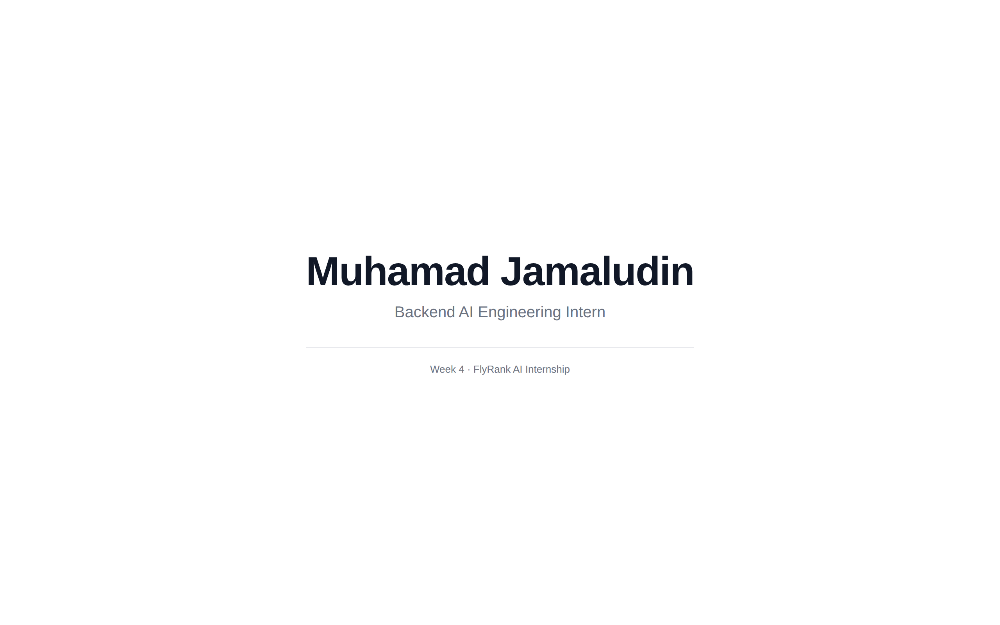

# ShipBlankPage — Empty But Live

**Assignment:** Empty but Live: Ship a Blank Page
**Date:** August 6, 2026
**Stack:** static HTML/CSS — the Option 1 stack chosen in
[ChooseYourStackwithAI](../ChooseYourStackwithAI/README.md), deployed to Vercel.

---

## Live URL

**https://ship-blank-page.vercel.app** (Vercel, production)

## What Was Shipped

A near-blank single-page site (`site/index.html`) that shows the identity line:

- **Muhamad Jamaludin** — Backend AI Engineering Intern
- Footer: Week 4 · FlyRank AI Internship

This is the "nothing to something on a URL" milestone: a real, reachable
address that the build weeks will fill with the Asset Guard portfolio.

Deployed to Vercel through the Vercel MCP (`deploy_to_vercel`, project
`ship-blank-page`, target production). This matches the chosen stack — a
static HTML/CSS site on Vercel. The source stays in the repo under
`site/index.html`, so the repository doubles as proof that the work ships.

## Verified Live

- HTTP 200 on a desktop render (~0.9 s, 1 511 bytes served), content
  byte-for-byte the intended page.

## Screenshot

  

## Verification note

The URL is confirmed live with an HTTP 200 from a desktop render, captured in
the screenshot above. A cross-check on a second device was considered optional
for this near-blank milestone and intentionally skipped.

## AI Workspace Loaded for the Build Weeks

The identity kit, case study, and content map are already committed in this
repository — everything the build weeks need in one place:

- Identity kit + logo: `week-3/GeneralAIFluency/IdentityKit/`
- Content map & CTAs (7 pages): `week-3/GeneralAIFluency/MapContentAndCTAs/README.md`
- Case study (Asset Guard): `week-2/GeneralAIFluency/FrameYourWork/data/case-study-asset-guard.md`
- Voice card: `week-2/GeneralAIFluency/FrameYourWork/data/voice-card.md`
- Implementation plan: `week-2/GeneralAIFluency/FrameYourWork/data/asset-guard-implementation-plan.md`
- Selected images: `week-3/GeneralAIFluency/CurratesImages/`

*Submitted to the internship portal — week-4 assignment card (URL in
Deliverable links, screenshot under Files).*
