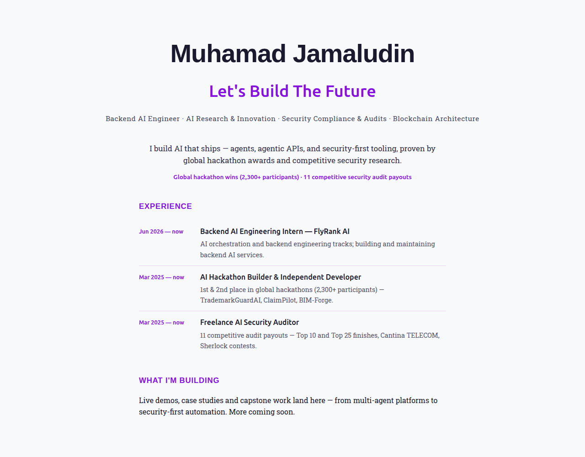

# Personal Website — Live on the FlyRank Domain

**Assignment:** Personal Website Live on the FlyRank Domain
**Date:** August 8, 2026
**Stack:** Static HTML/CSS (hand-written) on Vercel free tier — the same
[stack chosen in week-4](../week-4/GeneralAIFluency/ChooseYourStackwithAI/README.md).

**The site is live and it works.** One page, hand-written, deployed on
Vercel, HTTPS by default, with a clean CV-worthy URL:
https://muhamad-jamaludin.vercel.app. It carries the identity from the
week-3 Identity Kit, the four live links (LinkedIn, GitHub, resume,
booking), and the space for future posts and capstone work — and the DNS
walkthrough for the future FlyRank subdomain is already written.

---

## 1. Live URL

**https://muhamad-jamaludin.vercel.app** (Vercel, production)

The site name was set to a CV-worthy URL (`muhamad-jamaludin.vercel.app`)
instead of an auto-generated one, per the assignment requirement.

## 2. What the Page Contains

A single-page site (`site/index.html`) with:

- **Name + claim:** Muhamad Jamaludin — "Let's Build The Future"
- **Positioning:** Backend AI Engineer · AI Research & Innovation ·
  Security Compliance & Audits · Blockchain Architecture
- **Elevator line:** AI agents, agentic APIs, and security-first tools,
  backed by global hackathon awards and competitive security research
- **Highlights strip:** global hackathon wins (2,300+ participants) ·
  11 competitive security audit payouts
- **Experience:** FlyRank AI intern, independent hackathon builder,
  freelance security auditor — with real results (1st/2nd place of
  2,300+ participants, 11 competitive audit payouts)
- **Links:** LinkedIn (https://www.linkedin.com/in/muhamad-jamaludin-42178830a),
  GitHub, resume (Google Drive), and a Calendly booking link
- **Space for future posts and capstone work** (brief requirement)

The page follows the week-3 Identity Kit: Ubuntu headings, Roboto Slab
body, main color `#8511DF`, background `#F8F9FA`, accent `#E8D5F5`.

## 3. Verified Live

- HTTP 200 from the production URL, served over HTTPS.
- Content check: exactly the intended page (names, claim, all four links
  present and correct — GitHub profile verified).
- Pending user action: open https://muhamad-jamaludin.vercel.app in a
  private window (logged out) on a phone or second browser to confirm the
  clean public loading experience requested by the assignment.

## Screenshot

  

## 4. DNS Walkthrough

The CNAME + resolver-to-response walkthrough (½–1 page, written for a
non-technical reader) is in
[data/dns-walkthrough.md](data/dns-walkthrough.md). When the FlyRank
subdomain is provisioned after capstone approval, the checklist at the
end of that file is the exact set of steps to run: Ops creates the CNAME,
I add the custom domain in Vercel, wait for propagation, and confirm the
padlock.

## 5. Linked From (user actions, pending)

- LinkedIn: add https://muhamad-jamaludin.vercel.app to the profile
  (https://www.linkedin.com/in/muhamad-jamaludin-42178830a) website /
  contact section. No automated path — done manually by user.
- CV / resume: the current lean resume is kept as is; the URL is not
  added (user decision).

## 6. Conclusion

The assignment's core deliverable — a live HTTPS page on a clean public
URL — is shipped: https://muhamad-jamaludin.vercel.app. The page states
who I am and what I build, links every profile that matters, and sets
aside space for the capstone work coming next. The DNS walkthrough turns
the future invitation into a checklist: when `muhamadjamaludin.flyrank.ai`
is provisioned, adding the custom domain is a pointer, not a migration.
The site is now the single entry point a person needs to reach me, my
code, my resume, and a booking link — ready to be shared today, and ready
to grow with the capstone.

## Notes

- Source of truth stays in the repo (`site/index.html`), so the
  repository doubles as proof that the work ships.
- The deployment is a file-snapshot deployment via the Vercel CLI; the
  free URL will be reused when the FlyRank subdomain is provisioned —
  a custom domain is a DNS pointer.
