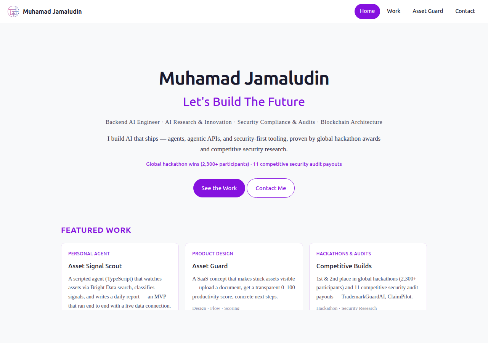
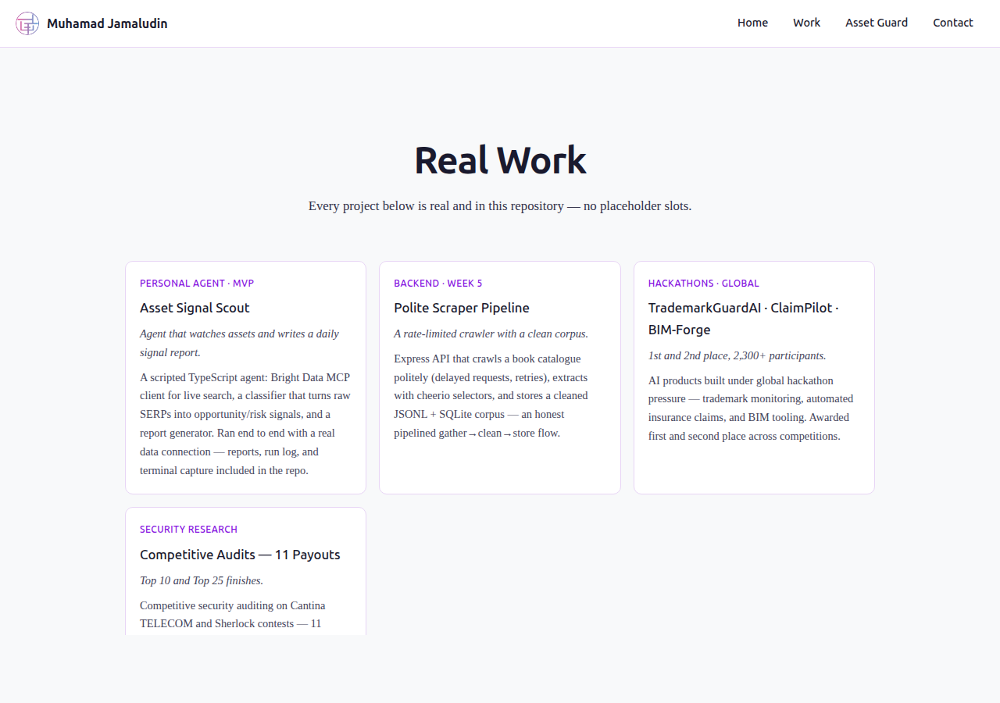
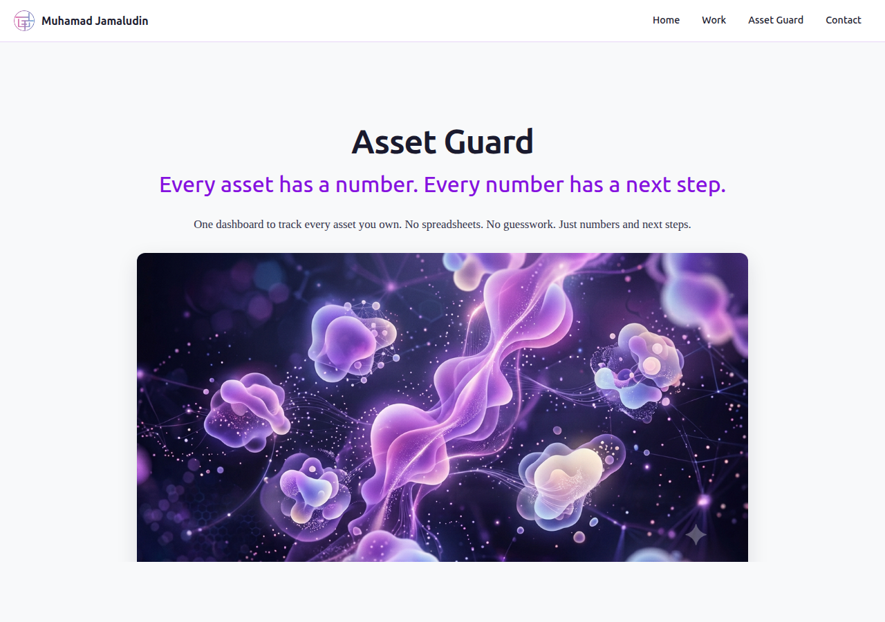
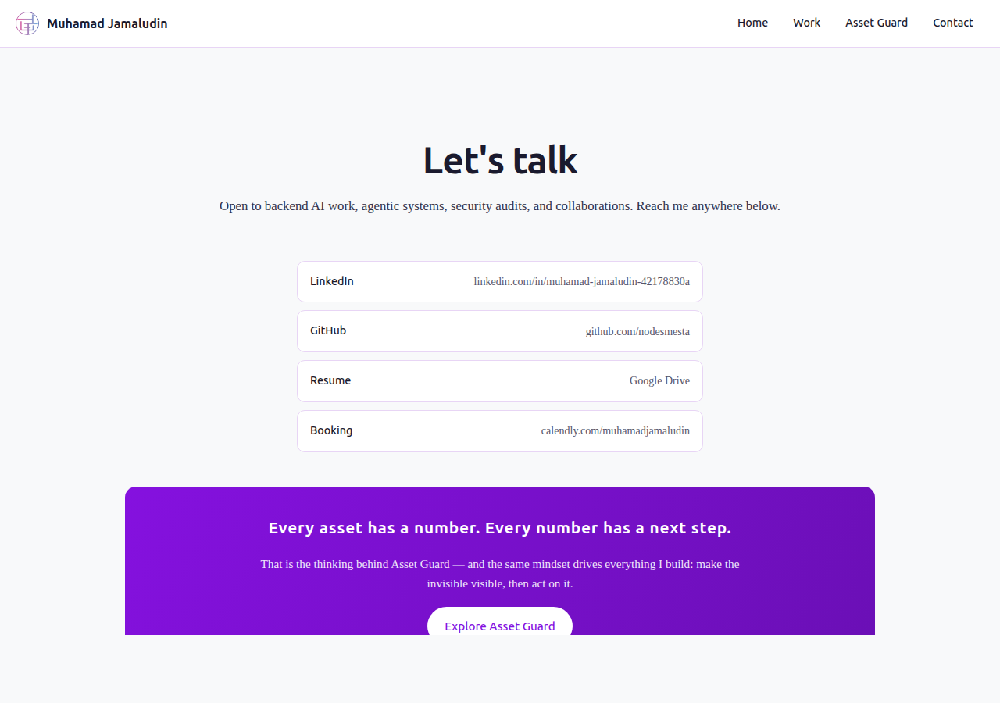

# Ship the Ugly One — Portfolio Live

**Assignment:** Ship the Ugly One (Week 5)
**Date:** August 8, 2026
**URL:** https://muhamadjamaludin-portfolio.vercel.app

**The portfolio is live and every sitemap page is reachable.** Four pages —
Home, Work, Asset Guard, Contact — built as a Next.js static export and
deployed on Vercel (team `flyrankintern`, project `muhamadjamaludin-
portfolio`, static export from this repo's `site/out/`). The real work is in:
the Asset Signal Scout MVP, the polite scraper pipeline, hackathon projects
with awards, security audit payouts, and the Asset Guard product story —
assembled page by page from the pieces built in weeks 1–4 (content map,
identity kit, curated images, case study). No placeholder slots.

---

## 1. Live URL & All Pages Reachable

**https://muhamadjamaludin-portfolio.vercel.app** (Vercel, production,
team `flyrankintern`)

The portfolio lives in its own project — `muhamadjamaludin-portfolio` —
separate from the personal one-pager (`muhamadjamaludin.vercel.app`), so
each keeps its own alias and deployment history.

| Page | Path | Status |
|------|------|--------|
| Home (landing) | `/` | HTTP 200 |
| Work (cases) | `/work` | HTTP 200 |
| Asset Guard | `/asset-guard` | HTTP 200 |
| Contact | `/contact` | HTTP 200 |

All pages verified live with `curl` (HTTP 200) and captured as screenshots
from the live URL (see section 3).

## 2. What Is In — Real Work, Cases, Look, Images

**The work (real cases, no placeholders):**
- **Asset Signal Scout MVP** — a scripted TypeScript agent that connects to
  Bright Data search live, classifies signals, writes a daily report (FL-07).
- **Polite scraper pipeline** — Express + Cheerio crawler with rate limiting
  that produced a cleaned JSONL/SQLite corpus (week-5 BE).
- **TrademarkGuardAI, ClaimPilot, BIM-Forge** — hackathon builds, 1st & 2nd
  place of 2,300+ participants.
- **Competitive security audits** — 11 payouts, Top 10/Top 25 finishes on
  Cantina TELECOM and Sherlock.

**The look** — the Identity Kit from week 3, applied consistently: Ubuntu
headings, Roboto Slab body, `#8511DF` main, `#1A1A2E` text, `#F8F9FA`
background, `#E8D5F5` accent, monogram logo in the navbar.

**The images** — the curated set from week 3: `hero.png` (AI-generated
abstract data visualization in kit purple) on the Asset Guard page, the
personal logo, and later the about photo when it exists.

**The case study** — Asset Guard's full story from week-2 (problem, what I
did, what came of it) lives on `/asset-guard` with the content-map features,
the 5-step upload→analyze→score→act→monitor orchestration, and honest
pricing ("designed, not live billing").

## 3. Verified Live — Screenshots (live URL)

Every screenshot below was captured with a headless browser against the
public URL, not a local preview.

  
  
  

  

## 4. How It's Built — No Unexplained Mystery Code

The site is a **Next.js App Router project written in TypeScript**, the same
stack family as my week-1 TS codebase — and the same layout as the week-5
personal website in this repo: everything lives under `site/src/`, with the
site settings (`next.config.ts`, `tsconfig.json`) one level up in `site/`.
Components are modular files, one per site section:

- `site/src/components/Navbar.tsx`, `Footer.tsx` — shared layout
- `site/src/components/Hero.tsx`, `FeaturedWork.tsx`, `CtaBanner.tsx` — the
  landing page sections
- `site/src/components/WorkList.tsx` — the real cases
- `site/src/components/Features.tsx`, `Orchestration.tsx`, `Pricing.tsx` —
  Asset Guard page
- `site/src/app/page.tsx`, `site/src/app/work/page.tsx`,
  `site/src/app/asset-guard/page.tsx`, `site/src/app/contact/page.tsx` — one
  file per route

Build: `npm run build:portfolio` (root monorepo script) → static export to
`site/out/`, deployed with the Vercel CLI. Everything is committed in this
repository — a reader can trace any piece of the site to its source.

## 5. One Real Set of Eyes (reaction, pending)

The link is ready to send to one real person — ideally someone in the target
field. Reaction note — what they saw, what confused them, whether the work
landed — will be added here once they have looked.

(Note: per the brief, this step is on me — send the live link to a real
person and capture their reaction.)

## 6. Still Ugly — The "ugly" list

Honest gaps the moment of shipping:

- **Asset Guard pricing is design-only** — the tiers say "TBD/custom";
  the product is not built, pricing is planned structure, not live billing.
- **Hero image is 1.3 MB** — fine on desktop, heavier than it should be
  for a phone; compress or replace later.
- **Consumer Say page is absent by design** — the week-3 content map lists
  testimonials, but no real testimonials exist yet; shipping placeholder
  quotes would have violated the "no empty slots" rule, so the page waits
  until there is something real to quote.
- **About/personal photo still pending** (needs a real photo).
- **Navbar active state is hydration-based** — the highlight appears after
  the page loads; negligible but not instant.

## 7. Conclusion

Four pages are live on one public URL: the work is visible, the cases open,
the look is the Identity Kit, and the images are real. This is the definition
of "ship the ugly version": complete enough to understand, published while
still rough, and now sent to one real person. The ugly list above is the
work queue for the next port.

## Notes

- Source of truth is the Next.js source in `site/src/`; `site/out/` is the
  exported static site and is overwritten by `npm run build:portfolio`.
- The previous single-page build lives on as the Contact page (per decision
  in this assignment: the one page becomes the contact page).