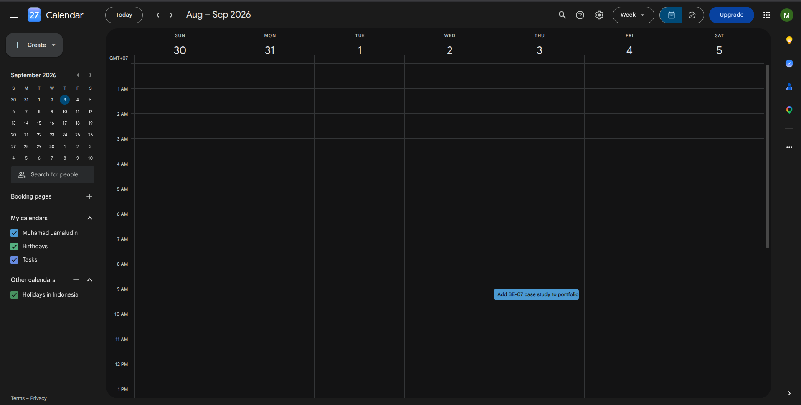

# Impact Project — The "How to Add the Next Case" System

**Assignment:** Impact Project
**Portfolio:** https://muhamadjamaludin-portfolio.vercel.app
**Date:** August 27, 2026
**Next piece named:** BE-07 — Connect to an AI API (POST /enrich)

The portfolio now has a concrete plan to keep growing: a written "how to add
the next case" note with exact file locations and steps, a specific next
piece of work named with a real calendar reminder set, and the build context
(voice card, identity kit, case studies, content map) preserved in one page
so the next case is a short conversation, not a rebuild.

---

## 1. The "How to Add the Next Case" Note

**File:** [`data/how-to-add-next-case.md`](data/how-to-add-next-case.md)

Not a vague intention — each step names a real file, a real command, or a
real check:

- **Where it goes:** the `cases` array in `site/src/components/WorkList.tsx`
  (renders the `/work` cards) plus a full three-beat write-up in the task's
  `data/` folder, same convention as the Week-2 case studies.
- **The shape:** the Week 2 three beats — the problem → what I did → what
  came of it — in the member's own words, voice card applied.
- **The steps:** 7 concrete steps from gathering the real material, through
  the one-question-at-a-time interview, to writing the beats, adding the
  card, building and auditing locally (`tsc --noEmit`, `next build`,
  multi-viewport audit), deploying to Vercel, verifying `/work` live, and
  replying to a reviewer with what changed.
- **The cost:** because the build context is preserved, the next case is a
  short conversation, not a rebuild — one interview + one draft, one array
  entry, one deploy.

## 2. The Named Next Piece — BE-07, Connect to an AI API

**File:** [`data/next-case-be07.md`](data/next-case-be07.md) (full three-beat draft)

The next real piece of work to be added to the portfolio is **BE-07 — Connect
to an AI API**, the Week-6 backend assignment: one endpoint (`POST /enrich`)
that sends a messy scraped book record to an LLM and returns clean,
schema-validated JSON the API can trust. Chosen because it is the freshest
completed work with full evidence already in the repo.

The three beats, in short:

| Beat | Summary |
|------|---------|
| The problem | The week-5 corpus was real but not clean: duplicated/truncated descriptions, placeholder `Default` categories. Hand-fixing does not scale, and raw LLM output cannot be trusted by code either. |
| What I did | One endpoint: input validation before any model call, versioned prompt file (`enrich-v1.md`), untrusted record sent as a user message (OWASP LLM01), parse → validate → repair-once → quarantine pipeline, explicit timeouts/retries/kill-switch/cost log, 8 labeled eval cases from the real corpus. |
| What came of it | Eval 8/8 (100%) on a healthy provider; the repair retry self-corrected a tampered invalid answer; the model independently reproduced the corpus's known quirks (`duplicate_text`, `truncated`, `mismatched_category`); $0 on the free tier; honest limits documented (weak when-unsure rule, non-deterministic temperature-0, flaky free tier). |

Adding it is one card in `WorkList.tsx` plus a deploy — the reminder below is
set for exactly that.

## 3. The Reminder (set)

**File:** [`data/reminder-be07-case-study.ics`](data/reminder-be07-case-study.ics)

A standard iCalendar (`.ics`) event, ready to import into Google Calendar
(2 clicks: calendar.google.com → Settings → Import & export → select file):

| Field | Value |
|-------|-------|
| Event | "Add BE-07 case study to portfolio (/work)" |
| When | Wed, 2026-09-03, 09:00–09:30 Asia/Jakarta (WIB) |
| Alarm | Popup 1 day before (Tue, 2026-09-02 09:00) |
| Action | Follow `how-to-add-next-case.md` steps 4–6: add the card, build + audit locally, deploy, verify `/work` live |
| Source | github.com/nodesmesta/flyrank-backend-intern/tree/main/week-6/BE-07 |

The `.ics` file is the machine-readable evidence of the reminder. It was
imported into Google Calendar on August 27, 2026 and verified visually — the
event appears on **Wed, Sep 3** with the notification set:

  

## 4. Build Context Preserved

**File:** [`data/build-context.md`](data/build-context.md)

One page that captures everything the build context already knows — this is
the "Claude Project" content accumulated since Week 2, ready to paste into
Project Instructions so the next case starts from decisions, not from zero:

- **Voice card (Week 2):** "Direct, technical, deliverable, visionary,
  original."
- **Proof statement (Week 1):** "I translate abstract product ideas into
  deployed, testable AI prototypes… working, testable MVP within five days."
- **Identity kit (Week 3):** Ubuntu / Roboto Slab, `#8511DF` /
  `#1A1A2E` / `#F8F9FA` / `#E8D5F5`, style note, logo.
- **Site facts:** live URL, stack, pages, one action (Contact Me), hero
  claim, the 44 px / 14 px / AA-contrast standards.
- **Current cases** (all four from the Work page) with source links.
- **Case shape:** the three-beat rule and the repo conventions.

The next case study therefore starts from a conversation the AI partner
already has the context for — voice, stack, and identity kit included.

## 5. Pass / Revise Check

| Requirement | Result |
|-------------|--------|
| Concrete "how to add the next case" note, not a vague intention | PASS — `data/how-to-add-next-case.md`: exact file locations, 7 named steps, verification commands |
| A specific next piece of work is named | PASS — BE-07 (POST /enrich), full three-beat draft in `data/next-case-be07.md` |
| A real reminder is set | PASS — `data/reminder-be07-case-study.ics`: dated event 2026-09-03 WIB with a 1-day popup alarm |
| Build context (Claude Project) preserved | PASS — `data/build-context.md`: voice card, identity kit, case studies, content map, site + repo facts on one page |

## 6. Files

| File | Responsibility |
|------|----------------|
| `data/how-to-add-next-case.md` | The concrete "how to add the next case" note (where + steps) |
| `data/next-case-be07.md` | The named next piece, full three-beat case study draft |
| `data/reminder-be07-case-study.ics` | The calendar reminder (iCalendar event + popup alarm) |
| `data/reminder-screenshot.png` | Visual evidence of the reminder in Google Calendar (imported 2026-08-27) |
| `data/build-context.md` | The preserved build context (Claude Project content) |
| `README.md` | This deliverable summary |

## Conclusion

The portfolio no longer depends on memory. The next case study has a written
path with real file locations and steps, a named piece of work (BE-07) whose
story is already drafted in the three-beat shape, a calendar reminder set to
make it happen, and the build context preserved so the AI build partner keeps
the member's voice, stack, and identity kit — the next case is a short
conversation, not a rebuild.
