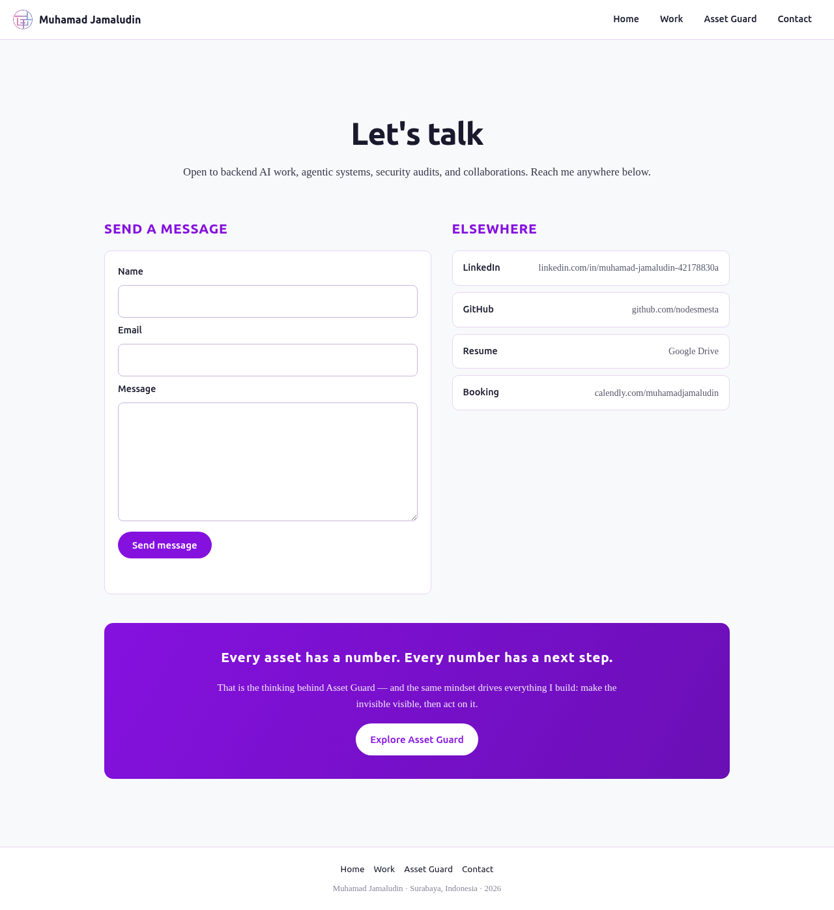
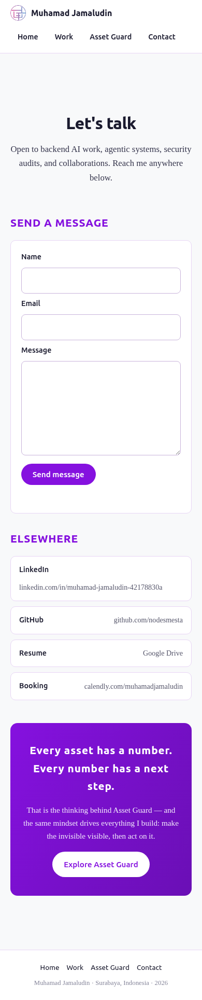

# Make It Do Something — Working Portfolio Contact Form

**Assignment:** Make It Do Something  
**Feature:** One working contact form  
**Live URL:** https://muhamadjamaludin-portfolio.vercel.app/contact/  
**Hosting:** Vercel production  
**Form backend:** Formspree free tier

The portfolio now has exactly one dynamic feature: a visitor can enter a name,
email address, and message on the Contact page and send it to me. The form is
live, the request reaches Formspree, the submission appears in the Formspree
dashboard, and Formspree delivers it to my target email inbox.

---

## 1. The One Feature

The Contact page contains one form with:

- a required name field;
- a required email field with browser email validation;
- a required message field;
- a submit button with a sending state;
- a clear success or error message after Formspree responds.

No database, login, file upload, newsletter capture, chatbot, or second dynamic
feature was added. The rest of the portfolio remains a static Next.js export.

## 2. Live End-to-End Evidence

The production test was performed through the form on the public URL, not by
posting directly to Formspree.

| Check | Result |
|---|---|
| Public Contact page | HTTP 200 |
| Form submission | One POST request |
| Formspree response | HTTP 200 |
| Browser result | `Thanks — your message has been sent.` |
| Verification code | `MIDOS-PROD-01` |
| Formspree dashboard | Submission received (confirmed by the account owner) |
| Target email inbox | Email received (confirmed by the account owner) |

### Production screenshots

Both screenshots were captured from the public production Contact page after
deployment. The fields are intentionally empty; the real delivery proof is the
separate `MIDOS-PROD-01` submission recorded above.

<div align="center">
  
  
</div>

This closes the real loop required by the brief: a visitor submits the live
form, the backend accepts it, and the message reaches me.

## 3. What a Backend Is — In Plain Words

A browser can show a form and collect what a visitor types, but the browser is
not a safe, permanent place to receive or store messages. A backend is the
service on the other side of the website that accepts the request, checks and
processes it, and sends back a result.

For this feature, Formspree is the backend. I did not build a separate server.
Formspree gives the form a public endpoint designed for website submissions. It
receives the three fields, records the submission in its dashboard, sends the
message to my configured target email, and returns an HTTP response that tells
the portfolio whether the request succeeded.

## 4. How the Data Flows

1. A visitor opens the public Contact page on Vercel.
2. The visitor enters a name, email address, and message.
3. The browser checks that all three fields are present and that the email has
   a valid email-shaped value.
4. When the visitor presses **Send message**, the React component packages the
   three values as form data.
5. The browser sends one HTTPS POST request to the Formspree form endpoint.
6. Formspree receives the data, stores the submission in the account dashboard,
   and forwards it to the configured target email.
7. Formspree returns an HTTP response to the browser.
8. If the response is successful, the form clears and shows a success message.
   If it is not successful, the form keeps the visitor informed with an error
   message instead of pretending the message was delivered.

The public endpoint is part of the frontend integration, not a secret API key.
No password, session cookie, private email credential, or Formspree API token is
stored in this repository.

## 5. Implementation

This assignment uses an isolated snapshot of the earlier portfolio, so the
week-5 source remains unchanged.

| File | Responsibility |
|---|---|
| `site/src/components/ContactForm.tsx` | Form UI, browser submit handling, and visible states |
| `site/src/lib/contactForm.ts` | Builds the form data, posts it to Formspree, and rejects failed responses |
| `site/src/app/contact/page.tsx` | Places the form on the existing Contact page |
| `site/src/app/globals.css` | Responsive form styling consistent with the existing Identity Kit |
| `site/tests/contact-form.test.ts` | Tests the POST payload and failed-response behavior |
| `site/tests/contact-form-ui.test.tsx` | Tests that the three required fields and submit control render |

The production site is still generated as static content. Formspree provides
the dynamic backend behavior without changing the portfolio into a custom
server application.

## 6. Verification

The implementation was verified before deployment:

- **Automated tests:** 3 passed, 0 failed.
- **TypeScript:** `tsc --noEmit` passed.
- **Production build:** Next.js 16.3.0 compiled successfully.
- **Static routes generated:** `/`, `/work`, `/asset-guard`, and `/contact`.
- **Desktop and mobile checks:** one form, three required fields, no horizontal
  overflow, and no broken images.
- **Preview review:** reviewed and approved before promotion to production.
- **Production:** deployment Ready; public Contact route HTTP 200.
- **Real delivery:** `MIDOS-PROD-01` reached both Formspree and the target inbox.

Commands used from the repository root:

```bash
npx tsx --test \
  week-6/GeneralAIFluency/MakeItDoSomething/site/tests/contact-form.test.ts \
  week-6/GeneralAIFluency/MakeItDoSomething/site/tests/contact-form-ui.test.tsx

npx tsc -p \
  week-6/GeneralAIFluency/MakeItDoSomething/site/tsconfig.json --noEmit

npx next build week-6/GeneralAIFluency/MakeItDoSomething/site
```

## 7. Pass / Revise Check

| Requirement | Result |
|---|---|
| Exactly one feature | PASS — one contact form |
| Working live end to end | PASS — public form to Formspree dashboard and target inbox |
| Free tier | PASS — Formspree free tier and existing Vercel hosting |
| Real test | PASS — production verification `MIDOS-PROD-01` |
| Plain-words backend explanation | PASS — sections 3 and 4 |
| Data flow understood | PASS — browser → Formspree → dashboard/email → browser response |

## Conclusion

The portfolio is no longer only a static presentation. Its one dynamic feature
does one useful job completely: a visitor sends a message and I receive it. The
implementation stays deliberately small, uses the existing static deployment,
adds no unnecessary infrastructure, and has a real production test proving the
entire data path.
