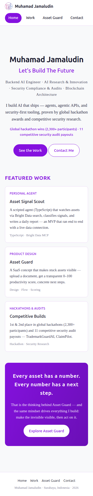
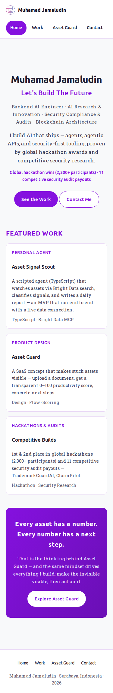
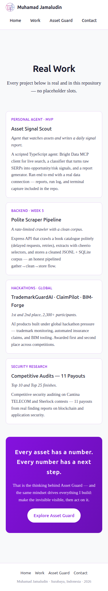
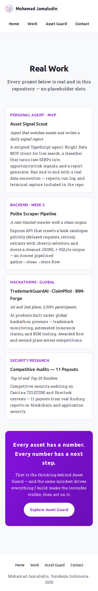
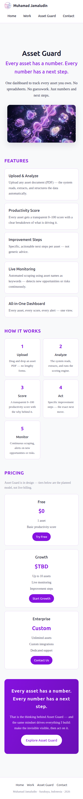
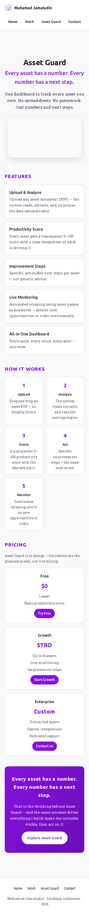
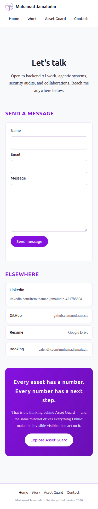
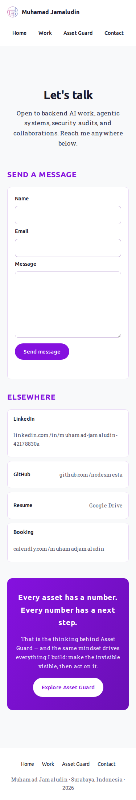

# Open It on Your Phone — Mobile-First Fixes on the Live Portfolio

**Assignment:** Open It on Your Phone
**Live URL:** https://muhamadjamaludin-portfolio.vercel.app/
**Hosting:** Vercel production
**Audited widths:** 375×812 (phone), 768×1024 (tablet), 1280×800 (desktop)

The portfolio was audited on phone, tablet, and desktop widths, the real
problems found on the live site were fixed, and the updated site is live on
the same URL. This page is the fix log the brief asks for: what was broken
and what changed, with before/after evidence.

---

## 1. How the Audit Was Done

The audit ran against the **live production URL** in a real browser engine, at
three viewports, across all four pages (`/`, `/work`, `/asset-guard`,
`/contact`). For every combination it measured:

- HTTP status and page load time;
- horizontal overflow (content spilling outside the viewport);
- browser console errors;
- every text element below 14 px (readability floor);
- every tap target below 44 px (thumb-friendly minimum);
- color contrast against WCAG AA (4.5:1 for normal text);
- every link's HTTP status, including the external links;
- image transfer size and load time.

What was already healthy: all pages returned HTTP 200 at all widths, there
was no horizontal overflow and no console error anywhere, body text contrast
passed, and the GitHub, Google Drive, and Calendly links resolved. The
problems below are the real ones the audit found.

## 2. Fix Log — What Was Broken and What Changed

| # | Before (broken) | After (fixed) | Where |
|---|---|---|---|
| 1 | `hero.png` was 1.36 MB (1,331 KB transferred, ~1.5 s) — the single heaviest asset on the site; `/asset-guard` was the slowest page on mobile (2,184 ms) | Re-encoded as `hero.webp`, 77.3 KB (−94%), same 1200×655 artwork | `site/public/img/` + asset-guard page |
| 2 | Labels and meta text below 14 px: card meta 12 px, card stack 12.8 px, footer 12.8 px, step text 13.1 px, hero highlights 13.6 px, pricing list 13.6 px, footer nav 13.6 px | Raised to a 14 px floor (0.875 rem); body text stays ≥14.4 px | `globals.css` |
| 3 | Tap targets below the 44 px minimum: footer links 22 px, featured-work titles 19 px, contact links 23 px, nav links 40 px, primary buttons 41 px | All interactive targets are now ≥44 px (padding + display fixes) | `globals.css` |
| 4 | `#88889C` on white = 3.47:1 — failed WCAG AA for normal text (footer, card stack, pricing note) | `#5E5E74` = 6.31:1 — passes AA | `globals.css`, `Pricing.tsx` |
| 5 | Ubuntu and Roboto Slab were declared in CSS but never loaded — every device silently rendered a different fallback font | Both fonts are now self-hosted via `next/font` (woff2, `display: swap`): consistent typography, zero external font request | `layout.tsx` |
| 6 | The LinkedIn link cannot be machine-verified — it resolves but sits behind LinkedIn's login wall (curl returns 999, scraper returns empty) | Not a code bug; the profile needs a manual open to confirm | contact page |

Note on links: the work cards intentionally carry no demo/repo links, so
there were no broken links to repair — every link that exists was checked.
The contact form (the previous assignment's live feature) was not touched and
still submits end to end.

## 3. Verification After the Fixes (production)

| Check | Result |
|---|---|
| 4 pages × 3 viewports | HTTP 200 |
| Horizontal overflow | 0 px on every page |
| Console errors | 0 |
| Text below 14 px | 0 |
| Tap targets below 44 px | 0 |
| Contrast | all pairs pass AA (worst fixed pair: 3.47 → 6.31) |
| Hero asset | 1,331 KB → 77 KB |
| `/asset-guard` mobile load | 2,184 ms → 270 ms |
| Fonts | self-hosted woff2, loaded from the site's own origin |

Load times were measured on the live URL with the audit script; the before-run
waits for `networkidle`, the after-run for `load`, so the absolute values are
not perfectly comparable — the exact, fully comparable win is the asset size
(1,331 KB → 77 KB), and the load drop comes from that plus the self-hosted
fonts. The other mobile pages also dropped: `/` 1,271 → 485 ms, `/work`
966 → 155 ms, `/contact` 900 → 164 ms.

Commands used from the repository root:

```bash
npx tsc -p week-6/GeneralAIFluency/MakeItDoSomething/site/tsconfig.json --noEmit
npx next build week-6/GeneralAIFluency/MakeItDoSomething/site

# repeatable audit (screenshots + metrics + summary)
node week-6/GeneralAIFluency/OpenItonYourPhone/audit.mjs \
  https://muhamadjamaludin-portfolio.vercel.app \
  week-6/GeneralAIFluency/OpenItonYourPhone/data/after
```

The same checks passed against the local production build before the deploy
(evidence in `data/after-local/`), then again on the live URL after deploy
(`data/after/`).

## 4. Before / After Screenshots — Phone Width (375×812)

Left column before, right column after, captured from the live URL. The full
set — mobile, tablet, and desktop for all four pages — is in `data/before/`
and `data/after/` with a machine-readable `report.json` per run.

<div align="center">
  
  
  
  
  
  
  
  
</div>

## 5. Files Changed

| File | Change |
|---|---|
| `site/src/app/globals.css` | text sizes, tap targets, contrast color, font variables |
| `site/src/app/layout.tsx` | Ubuntu + Roboto Slab via `next/font` (self-hosted) |
| `site/src/app/asset-guard/page.tsx` | `hero.png` → `hero.webp` |
| `site/src/components/Pricing.tsx` | pricing note size + contrast |
| `site/public/img/hero.webp` | new compressed hero (77.3 KB) |
| `site/public/img/hero.png` | removed (1.36 MB, superseded) |

## Conclusion

The portfolio now reads and behaves properly at phone width — readable text,
thumb-sized tap targets, AA contrast, self-hosted typography, and a 94%
smaller hero asset that cut the slowest page's load from ~2.2 s to ~0.3 s.
Every fix was driven by a measurement on the live site, and the same
measurements pass again after the deploy, so the fix log is not a list of
guesses — it is a list of problems found, then re-checked.
