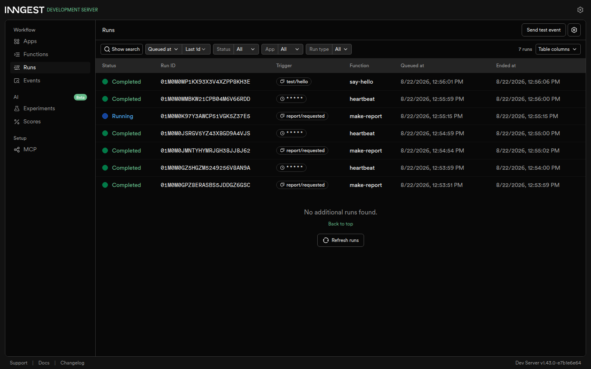
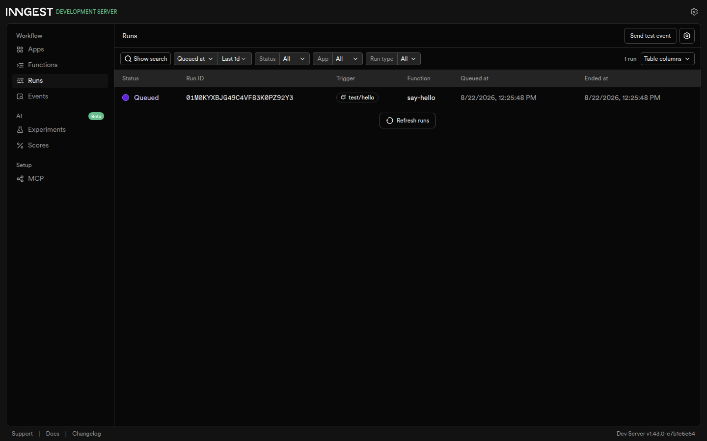

# Week 7 · BE-06 — Your First Background Job

A small API whose slow work (a report that takes ~8 s to make) runs in a
**background job** instead of inside the request. The endpoint answers
instantly with `202`, a worker builds the report off the request path, and a
status endpoint reports progress. One **cron** function runs on a clock alone.

The background machinery is **Inngest** — the same tool FlyRank runs in
production — with its local Dev Server and a dashboard where every run, step
and retry is visible.

The pattern is the one behind every progress bar and every "we'll email you
when it's ready" on the internet: **accept fast, work in the background,
report status.**

```
client asks  -> POST /reports  -> 202 { id, status: "pending" }   (in ~1 ms)
worker       -> make-report sleeps 8 s, then builds the result
client polls -> GET /reports/:id -> pending  ...  done + result
clock        -> heartbeat (cron * * * * *) logs a per-status summary
```

## Run it

Two documented commands. From the repo root (monorepo scripts follow the
`:be` convention):

Terminal 1 — the API (listens on port 3000):

```bash
npm run start:be7          # one-shot
npm run dev:be7            # watch mode
```

Terminal 2 — the Inngest Dev Server + dashboard:

```bash
npx inngest-cli@latest dev -u http://localhost:3000/api/inngest
```

Open the dashboard at <http://localhost:8288>. Keep both terminals running.

Config lives in the scripts and environment: `INNGEST_DEV=1` (local-dev mode,
so the SDK and the Dev Server talk to each other) and `PORT` (default 3000).
There are no credentials — the whole assignment is free and runs on your
machine, no account, no card.

## Endpoints

| Method | Path | Description | Status codes |
|--------|------|-------------|--------------|
| POST | `/reports` | Body `{ "topic": "cats" }` → saves a `pending` report, sends the `report/requested` event, answers immediately | `202`, `400` (missing/empty topic, no event sent) |
| GET | `/reports/:id` | The saved report: `pending` first, then `done` + `result`, or `failed` | `200`, `404` (unknown id) |
| GET | `/health` | Liveness probe | `200` |

The reports live in an **in-memory** map. It forgets everything on restart —
that is the assignment's design on purpose (the same "safe to forget" lesson
as the first in-memory CRUD week); the audit point is the *background-job
pattern*, not persistence.

## Inngest functions

| id | Trigger | Work |
|----|---------|------|
| `say-hello` | event `test/hello` | sleeps 5 s, returns `"Hello from the background!"` |
| `make-report` | event `report/requested` | sleeps 8 s (`do-the-slow-work`), then runs `build-report`; `retries: 2`; topic `"fail"` throws inside the build step so you can watch the retries |
| `heartbeat` | cron `* * * * *` (every minute) | logs one summary line: `pending` / `done` / `failed` counts |

Because the slow work is a stand-in `step.sleep("do-the-slow-work", "8s")`,
you can watch the job progress step by step in the dashboard without paying
for a slow third-party call.

## Proof — accept fast, work later

`POST /reports` answers in ~1.3 ms (way under a second), and the same poll
flips from `pending` to `done` seconds later once the background job finishes:

```
POST /reports {"topic":"voyages"}          HTTP 202  | 0.001337s
{ "id": "report_eefc7c41-4959-416e-8b3b-aa21a1c35516", "status": "pending" }

GET /reports/:id  (immediately)   -> { ..., "status": "pending" }
GET /reports/:id  (~9 s later)    -> { ..., "status": "done",
                                          "result": "Report for \"voyages\": crawled, headings extracted, content indexed." }
```

The request is fast even though the work is slow — the endpoint does **no**
slow work.

## Stage 3 — when a 400 is the door, when a retry is the cure

>A wrong *input* must be rejected at the door and never start a job; only a
>wrong *moment* (a transient failure in a job, like a network hiccup) deserves
>a retry.

That is why `POST /reports` with no `topic` returns `400` and sends **no**
event — whereas `make-report` with topic `"fail"` runs 3 attempts (the two
retries) and ends **Failed** in the dashboard, with backoff growing between
attempts. Bad input is cheap to fix; a bad moment self-heals.

## Stage 4 — reading and writing cron

- To run every **day at 08:00**, the cron expression is **`0 8 * * *`** (minute 0, hour 8, every day-of-month/month/day-of-week).
- To run every **Sunday at 22:00**, the cron expression is **`0 22 * * 0`** (minute 0, hour 22, day-of-week 0 = Sunday).

`heartbeat` uses `* * * * *` (every minute) only for testing — a real system
would schedule it daily.

## Dashboard

The Dev Server's dashboard (localhost:8288) shows every function, run, step
and retry live. Two views capture what this session produced — the run stream
and a single completed `say-hello` run:

<div align="center" style="display:flex; flex-wrap:wrap; gap:12px; justify-content:center;">
  <figure style="flex:1 1 46%; min-width:280px; margin:0;">
    
    <figcaption style="text-align:center; font-size:12px; opacity:.8;">
      Runs stream: completed <code>make-report</code> runs, the failed
      <code>fail</code> run, and <code>heartbeat</code> ticks
    </figcaption>
  </figure>
  <figure style="flex:1 1 46%; min-width:280px; margin:0;">
    
    <figcaption style="text-align:center; font-size:12px; opacity:.8;">
      <code>say-hello</code> — a completed single-function run
    </figcaption>
  </figure>
</div>

A completed `make-report` run shows its two steps; a `topic: "fail"` run shows
the three attempts ending **Failed**; `heartbeat` appears once a minute with
its summary line.

## Tech stack

| Layer | Choice |
|-------|--------|
| Runtime | Node.js + TypeScript (tsx) |
| Web framework | Express |
| Background jobs + cron | Inngest (SDK + local Dev Server) |
| Reports storage | in-memory map (assignment design) |

## Project structure

```
week-7/BE-06/
├── README.md
├── task.md
├── W6 - Your first background job.pdf
├── src/
│   ├── server.ts       Express API: /health, /reports, serve /api/inngest
│   ├── functions.ts    Inngest client + say-hello, make-report, heartbeat
│   └── store.ts        in-memory report store (pending/done/failed)
└── data/evidence/      dashboard screenshots
```
