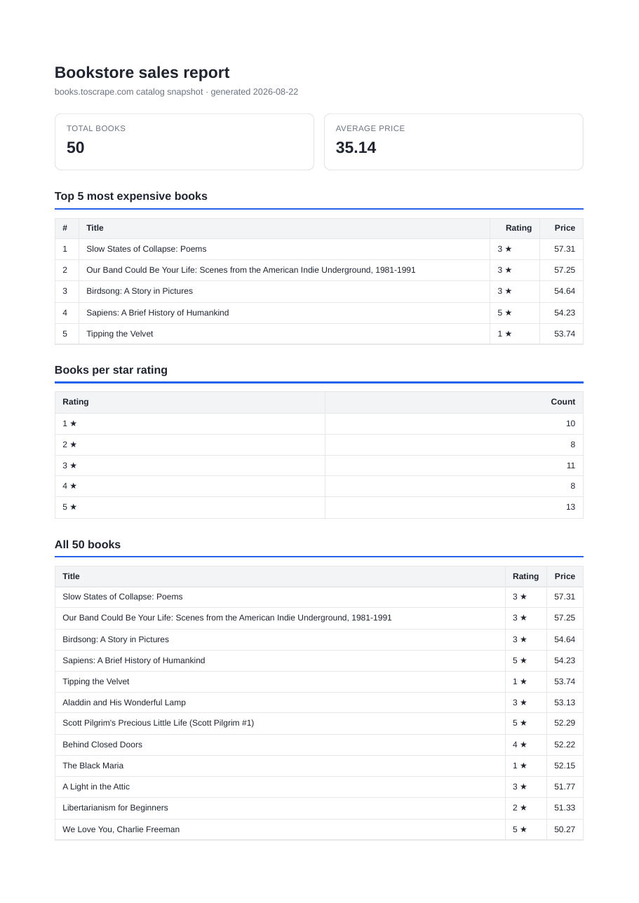

# Week 7 · BE-08 — PDF Report Generator

A small API that turns real data into a **real PDF file** and hands that file
out **by link**. The same pipeline every SaaS reports feature ships: pull a few
numbers out of a database with **SQL aggregation**, pour them into an **HTML
template**, ask a headless browser to "print" it to a **PDF**, store the file on
disk, and serve it to the client — JSON responses never carry the file's bytes.

## Summary

- **Dataset**: the assignment's **bookstore option** — the 50 validated book
  records my week-5 polite scraper collected from books.toscrape.com
  (`week-5/BE/data/books.jsonl`), the same corpus week-6 reused.
- **Query**: four aggregation queries turn the rows into numbers — `COUNT(*)`,
  `AVG(price)`, a top-5 by price, and a `GROUP BY rating` breakdown.
- **Render**: one HTML template + Playwright's headless Chromium → a PDF; the
  classic page-break trap is fixed with `tr { break-inside: avoid }` plus a
  repeating `<thead>`.
- **Store & link**: the file lives on disk (`reports/<id>.pdf`); the API keeps
  only its address. Only the download endpoint moves megabytes.
- **Idempotent**: double-clicking "generate" makes **one** file for the day —
  the second request returns the same id with `200`.
- Verified live: `POST /reports` answers `201` + a link in ~0.28 s, the
  download returns a real 3-page PDF, and an unknown id/file is a `404`.

```
SQL aggregation  ->  HTML template  ->  headless Chromium  ->  reports/<id>.pdf
     (few numbers)     (one page)         (page.pdf(), A4)        (store + link)
```

## Run it

From the repo root (monorepo scripts follow the `:be8` convention):

```bash
npm run seed:be8      # fill report.db from the week-5 book corpus (safe to run twice)
npm run report:be8    # (optional) print the aggregation object as JSON
npm run start:be8     # the API, listens on port 3000
npm run dev:be8       # watch mode
```

Then use the API (`BOOK = id from POST`):

```bash
curl -X POST http://localhost:3000/reports      # 201 + { id, file }
curl http://localhost:3000/reports/<BOOK>        # the report row + link
curl -o my-report.pdf http://localhost:3000/reports/<BOOK>/file
```

The seed script is the recipe; `reports/` and `report.db` are generated
artifacts and are gitignored. Everything is free and runs on your machine.

## The aggregation SQL

"Nobody reads 200 rows. Everybody reads five numbers." Four queries feed the
report (`getReportData()` in `src/report.ts`):

```sql
-- total number of books                     -> 50
SELECT COUNT(*) FROM books;

-- average price (round to cents)            -> 35.14
SELECT ROUND(AVG(price), 2) FROM books;

-- top 5 most expensive books
SELECT title, price, rating FROM books ORDER BY price DESC LIMIT 5;

-- number of books per star rating
SELECT rating, COUNT(*) FROM books GROUP BY rating ORDER BY rating;
```

The `GROUP BY` split is validated against the row count: the per-rating buckets
sum to 50 (`1*10 + 2*8 + 3*11 + 4*8 + 5*13`), which is how I know the query is
right and not just plausible.

## Endpoints

| Method | Path | Description | Status codes |
|--------|------|-------------|--------------|
| POST | `/reports` | Runs the whole pipeline in the request, stores the PDF, answers with a link. If a report was already generated today, returns the existing id + link instead. `{"force":true}` skips the once-per-day check. | `201` new (or `200` idempotent) |
| GET | `/reports/:id` | The report row (id, created_at) + its file link | `200`, `404` unknown |
| GET | `/reports/:id/file` | Serves the stored PDF from disk | `200`, `404` missing |

## Proof — generate, download, ask twice

A real run (timed): the pipeline answers `201` with a link after a visible
pause — the endpoint is doing the work, and that pause is the point.

```
$ time curl -X POST http://localhost:3103/reports
{"id":"a98e0448-...","file":"/reports/a98e0448-.../file"}
HTTP 201
real  0m0.277s

$ curl http://localhost:3103/reports/a98e0448-...
{"id":"a98e0448-...","created_at":"2026-08-22T07:00:12.475Z","file":"/reports/a98e0448-.../file"} | HTTP 200

$ curl -o my-report.pdf http://localhost:3103/reports/a98e0448-.../file    # download HTTP 200, 43509 bytes
$ file my-report.pdf
PDF document, version 1.4, 3 page(s)
```

Paths exist only in rows: `report.db` holds the file's on-disk path, `GET
/reports/:id` returns nothing but a link, and only the file endpoint sends
bytes. An unknown id and an unknown file each answer `404`.

### Asking twice gets one file

Two rapid `POST /reports` calls on the same day return the **same id** with
`200`, and `reports/` gains exactly **one** new file; `{"force":true}` makes a
fresh id with `201`:

```
POST {}              -> 200, id a98e0448-... (reused, no new file)
POST {}              -> 200, id a98e0448-... (reused again)
POST {"force":true}  -> 201, id cad6cba5-... (a new file)
```

The check protects against the double-click that would otherwise ship two
copies of the same artifact to the same place. Real-world cost of a missing
check: "never email a customer twice" — a marketing job that runs twice because
a deploy retried it would fire two identical promotional emails to every
recipient, paying for the extra sends and burning customer trust.

## Stage 4 — when I'd move this out of the request

Right now the blocking pipeline (Chromium launch + render + save) makes the
request answer in about a third of a second — fine for one user clicking one
button. I'd move it into a background job once the report stopped being cheap:
when the data grows to thousands of rows or the PDF grows into megabytes, when
several users could hit generate at once, or when generation depends on a slow
third-party call (an AI excerpt, a remote export) — that is when a seconds-long
blocking endpoint turns fragile and holds the user hostage, and the A7
"accept fast, work in the background, report status" pattern (already built in
BE-06) is the fix.

## Project structure

```
week-7/BE-08/
├── README.md
├── task.md
├── W7 - PDF report generator.pdf
├── src/
│   ├── server.ts       Express API: /health, POST /reports (idempotent), GET /reports/:id, GET /reports/:id/file
│   ├── report.ts       getReportData() SQL aggregation + HTML template + Playwright PDF
│   ├── db.ts           better-sqlite3 connection + books / reports schema
│   ├── seed.ts         seeds books from week-5/BE/data/books.jsonl (delete-then-insert)
│   ├── test-report.ts  Stage 2 checkpoint: prints the aggregation object as JSON
│   └── test-pdf.ts     Stage 3 checkpoint: renders reports/test.pdf
├── data/evidence/      page-1 screenshot of the generated PDF
├── reports/            generated PDFs (gitignored)
└── report.db           SQLite database (gitignored)
```

Report page 1, rendered by this pipeline from the real corpus:

<div align="center">
  <figure style="margin:0;">
    
    <figcaption style="text-align:center; font-size:12px; opacity:.8;">
      <code>reports/&lt;id&gt;.pdf</code> page 1 — summary cards, top-5, per-rating, and the start of the all-50-books table
    </figcaption>
  </figure>
</div>

## Tech stack

| Layer | Choice |
|-------|--------|
| Runtime | Node.js + TypeScript (tsx) |
| Web framework | Express |
| Database | SQLite via `better-sqlite3` (`report.db`) |
| PDF rendering | Playwright + headless Chromium (`page.pdf()`, A4, printBackground) |
| Serving files | Express `res.sendFile` |

## Conclusion

This assignment connects four skills into one feature. The SQL aggregation
turns 200-ish rows into five numbers people can actually read; the HTML
template and Playwright turn those numbers into a real multi-page PDF (the
page-break trap is the one non-obvious piece — `break-inside: avoid` and a
repeating `<thead>` keep rows whole and headers on every page); and the API
shows the **store-and-link** rule: `reports/` holds the bytes, the JSON holds
only addresses, and a single endpoint moves the file. The once-per-day check is
idempotency in business clothes — same request twice, one file.

Two things carry forward. First, the "feel the wait" moment: a plain endpoint
that takes a third of a second is fine today, but it is the same shape of
problem A7 solved, and the README records exactly when I'd reach for that
pattern. Second, the data is not invented for the demo — it is the 50-book
corpus my polite scraper actually collected, which is what makes the report
worth showing. The pipeline stays deliberately small and synchronous, matching
the assignment's required path.
