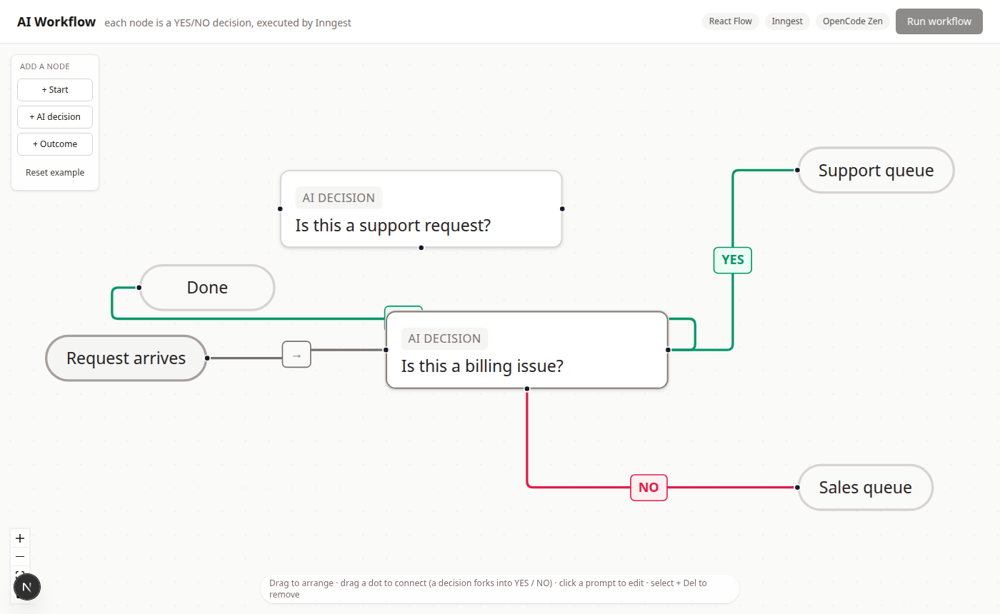
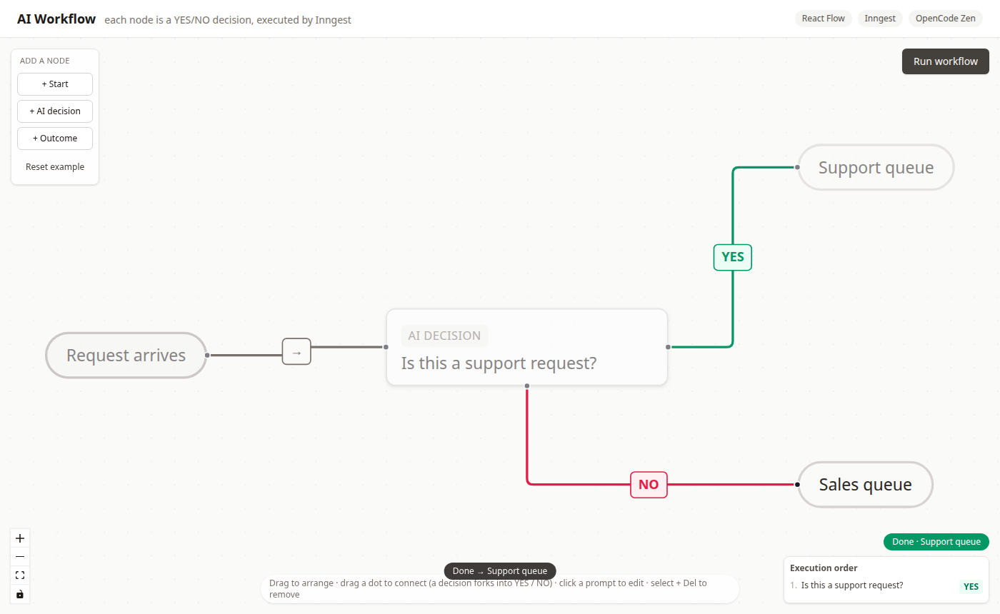
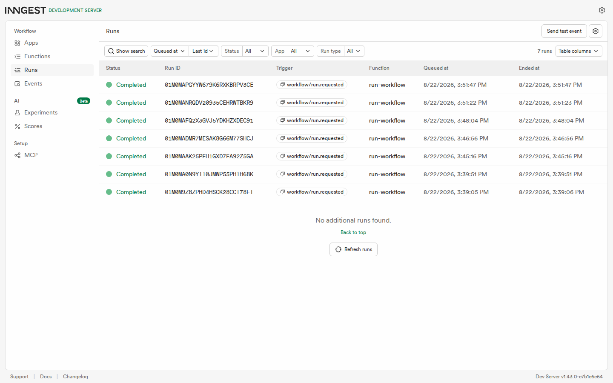
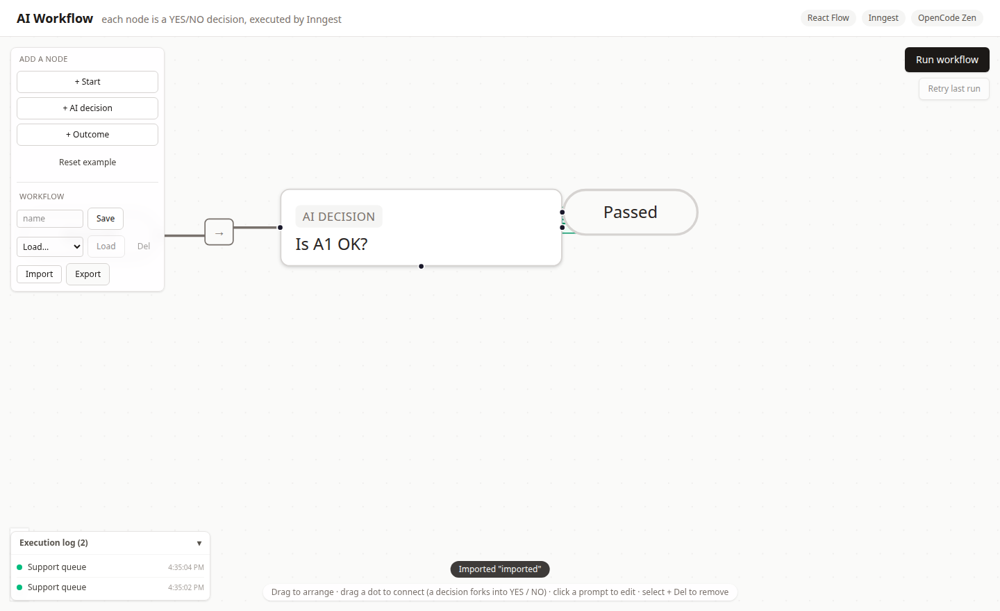

# Week 7 · BE-09 — Visual AI Workflow

A **visual AI workflow** tool: every node in the canvas is a **YES/NO AI decision**
(an LLM answers one question with only `YES` or `NO`), and the workflow is
executed by **Inngest** while the flow is built and visualised in **React Flow**.

This is Phase 1 (Setup) of a four-phase build — the scaffolding, wiring and
environment in which the flow editor (Phase 2) and the Inngest-executed AI graph
(Phase 3) will live.

## Phase status

| Phase | Goal | Status |
|-------|------|--------|
| 1 | Setup — app, React Flow, Inngest, OpenAI SDK, Shadcn, env, structure | ✅ done |
| 2 | Foundations — visual flow editor, YES/NO edge types, editable prompts | ✅ done |
| 3 | Build — every node → Inngest step, LLM returns YES/NO, dynamic traversal | ✅ done |
| 4 | Polish — ≥3 of: execution state, logs panel, save/load, export/import, styling, retries | ✅ **done (this commit)** |

## Summary

- **Two parts, one repo**: a Next.js site (`site/`) renders the React Flow canvas;
  an Express + Inngest server (`src/`) is the workflow engine and exposes
  `/api/inngest` for the Dev Server to discover and run functions. Both share the
  repo-root dependencies (single hoisted install — the monorepo convention).
- **React Flow wired**: the canvas already renders a running two-branch graph —
  `Request arrives → "Is this a support request?"` with a **YES** edge to
  `Support queue` and a **NO** edge to `Sales queue`, the exact example shape the
  assignment describes.
- **Inngest alive**: the Dev Server discovers and runs an `engine-ping` function
  (event `workflow/ping` → `pong from the AI workflow engine`), proving the
  app ↔ Dev Server loop before any workflow logic exists.
- **Shadcn (light)**: Tailwind v4 + the `cn` helper + `Button` / `Card` UI
  primitives, so the UI is consistent without the full shadcn CLI.
- **LLM provider configured**: `openai` SDK + OpenCode Zen free tier (the lane
  already proven in this repo at week-6) — three env vars ready for Phase 3.
- **Interactive editor (Phase 2)**: add nodes from a palette, drag between
  handles to connect (a decision forks into YES / NO), click a prompt to edit it
  inline, arrange nodes freely, and delete with Del — the whole graph is
  persisted to `localStorage` and restored on reload.
- **Executor (Phase 3)**: **Run workflow** sends the graph to `POST /runs`; an
  Inngest `run-workflow` function walks it — every decision node is a
  `step.run` that asks the LLM for YES/NO and follows the matching edge — while
  the editor polls `GET /runs/:id` and shows the traversal order as it happens.
  The model answers are real (OpenCode Zen free tier, verified live).
- **Polish (Phase 4)**: a persistent **execution log** panel (survives reload), named
  **save / load** of workflows plus **JSON export / import**, **animated** edges
  along the taken path, and a **Retry** button to re-run the last workflow.

## The executor (Phase 3)

The editor's **Run workflow** button is wired end-to-end:

1. The current graph (`{nodes, edges}`) is POSTed to `POST /runs`. The endpoint
   validates, saves a run, fires the `workflow/run.requested` event and answers
   `202` instantly — no slow work in the request.
2. Inngest runs the **`run-workflow`** function: it starts at the `start` node
   and walks the graph, pushing each visit to the run's `path`. For every
   `decision` node it performs a **`step.run`** that sends the node's prompt to
   the LLM and requires a single-word `YES` or `NO` (parse + one repair retry
   via `src/llm/client.ts`); it then follows the edge whose `data.branch`
   matches the answer. Reaching an `end` node finishes the run with its outcome
   label.
3. `GET /runs/:id` reports progress — `queued → running` (with the live `path`
   and current node) `→ done` (with the `trace`: each prompt → `YES`/`NO`) or
   `failed`. The editor polls it and highlights the flow as it traverses.

Verified live against the running backend (real HTTP):

```
POST /runs  (default two-branch graph)   HTTP 202  { id, status: "queued", startNodeId }
GET /runs/:id  => done
  path:     ["start", "gate", "support"]
  trace:    [{ prompt: "Is this a support request?", answer: "YES", model: "hy3-free" }]
  result:   { endNodeId: "support", outcome: "Support queue" }
POST /runs (neutral prompt)              -> NO branch   -> end "Phone"
POST /runs (decision missing a NO edge)  -> failed     "No NO edge from decision node d"
POST /runs {"edges":[]}                  -> 400         "nodes array is required…"
GET  /runs/unknown                       -> 404         "Run not found"
```

And the real (non-stub) model call is documented: today the Zen free pool
rotated again (`deepseek-v4-flash-free` → "Model is unavailable", so I probed
`/models` and switched to **`hy3-free`**). The run above used a real `hy3-free`
call that answered `YES`.

## The flow editor (Phase 2)

The canvas is now a working editor, not a static picture:

- **Add nodes** from the panel — `Start`, `AI decision` (the YES/NO question),
  and `Outcome`.
- **Connect nodes** by dragging from a source dot to a target dot. A decision
  node exposes **two** source handles (`YES` and `NO`), so the branch you draw is
  encoded straight into the edge; the start node has one neutral output.
- **YES / NO edge types** — three custom edge components (`yesedge` emerald,
  `noedge` rose, `flowedge` stone) render the smooth-step path, an arrowhead and
  a `YES` / `NO` badge, and each edge stores `data.branch` (`yes` / `no` /
  `next`) — the exact field Phase 3's executor will read.
- **Edit node prompts** inline — click any prompt or label, type, Enter commits
  (Escape cancels). `updateNodeData` keeps the graph state controlled.
- **Store graph state locally** — every edit writes `{nodes, edges}` to
  `localStorage` (`be9:workflow:v1`); on load the editor restores what you
  saved, or falls back to the two-branch example.

Verified against the running dev server (Playwright drives the real UI):

```
initial graph                     4 nodes, 3 edges (YES + NO example)
click "+ AI decision", "+ Outcome" → 6 nodes
drag the decision's YES handle onto an Outcome node → 4 edges (3 → 4)
click a prompt, type, Enter  →  localStorage gains "Is this a billing issue?"
reload ↓                        edited graph restored (6 nodes, 4 edges)
console                         0 errors
```

## Polish (Phase 4)

Five upgrades from the assignment's polish menu, each verified against the
running site:

- **Execution logs panel** — every finished run is appended to a persistent log
  (`be9:runlog:v1`) in the bottom-left panel; expand a run to see its path and
  the YES/NO trace. It survives reloads.
- **Save / load workflows** — type a name and **Save**; **Load** it back from the
  dropdown (localStorage slots, node positions preserved), **Del** to remove.
- **JSON export / import** — **Export** downloads the graph as
  `be9-workflow-<name>.json`; **Import** reads one back in (a graph round-trips).
- **Animated active edges** — the edges actually traversed get React Flow's
  animated dashdraw plus a thicker stroke and a soft glow, so the executed path
  stays visible on the canvas.
- **Retry** — re-runs the last submitted graph (handy after a `failed` run).

Verified live (`next start`, Playwright drives the real UI):

```
click Run                                  -> Done · Support queue
execution log                              -> 1 entry ("Support queue"); +1 after Retry
reload                                     -> run log still present (persists)
Save "demo-branch" then reload             -> slot listed in the Load dropdown
Export                                     -> downloads be9-workflow-workflow.json
Import a JSON graph                        -> 3 nodes, "Kickoff" label, toast "Imported"
animated (taken) edges after a run         -> 2 edges
console / page errors                      -> none
```

## Run it

From the repo root (monorepo scripts follow the `:be9` convention):

Terminal 1 — the API + Inngest function host (listens on port 3000):

```bash
npm run start:be9        # one-shot
npm run dev:be9          # watch mode
```

Terminal 2 — the Inngest Dev Server + dashboard:

```bash
npx inngest-cli@latest dev -u http://localhost:3000/api/inngest
# dashboard at http://localhost:8288
```

Terminal 3 — the frontend (React Flow editor, port 3001):

```bash
npm run dev:be9-site     # http://localhost:3001
npm run build:be9-site   # production build of the site
```

Proving the loop by hand — send `workflow/ping` and watch `engine-ping` run:

```bash
npm run start:be9
# (in another terminal) send the event, then check the dashboard run stream
INNGEST_DEV=1 npx tsx week-7/BE-09/src/test-ping.ts
```

Environment lives in `week-7/BE-09/.env` (copy `.env.example`), loaded explicitly
by `src/config.ts`. The LLM variables (`LLM_BASE_URL`, `LLM_API_KEY`,
`LLM_MODEL`, plus `LLM_STUB`, `LLM_ENABLED`, `LLM_TIMEOUT_MS`) drive the Phase 3
executor; the free tier needs an **empty** key (only a non-empty key is signed
onto the Authorization header).

Run a workflow by hand:

```bash
curl -X POST http://localhost:3000/runs \
  -H "Content-Type: application/json" \
  -d '{"nodes":[{"id":"s","type":"start","data":{"kind":"start","label":"Go"}},{"id":"d","type":"decision","data":{"kind":"decision","prompt":"Is this a support request?"}},{"id":"Y","type":"end","data":{"kind":"end","label":"Support"}}],"edges":[{"id":"a","source":"s","target":"d","sourceHandle":"next","data":{"branch":"next"}},{"id":"b","source":"d","target":"Y","sourceHandle":"yes","data":{"branch":"yes"}}]}'
# -> 202 { id, status: "queued", startNodeId: "s" }
curl http://localhost:3000/runs/<id>      # -> done + trace (with the real model)
```

## Endpoints

| Method | Path | Description | Status |
|--------|------|-------------|--------|
| GET | `/health` | Liveness probe | `200` |
| POST | `/runs` | Accept a graph `{ nodes, edges }`, save a run, dispatch `workflow/run.requested` to Inngest, answer instantly | `202`, `400` (missing/empty nodes or edges) |
| GET | `/runs/:id` | Execution state: path, current node, YES/NO trace, or `failed` with reason | `200`, `404` unknown id |
| POST | `/api/inngest` | Inngest function discovery + execution (Dev Server) | — |

## Verified live

```
GET /health                                HTTP 200  {"status":"ok"}
POST /runs (two-branch graph)              HTTP 202  { id, status: "queued", startNodeId }
GET /runs/:id  -> done
   path: ["start","gate","support"] · trace: [{ "Is this a support request?", YES }]
   result: { endNodeId: "support", outcome: "Support queue" }   (real model: hy3-free)
POST /runs (neutral prompt)                -> NO branch -> end "Phone"
POST /runs (decision missing a NO edge)    -> failed  error "No NO edge from decision node d"
POST /runs {"edges":[]}                    -> 400  "nodes array is required…"
GET /runs/unknown                          -> 404  "Run not found"
site (next start :3100) click Run          -> Done · Support queue, Execution order 1. … YES,
                                             3 nodes highlighted, 0 console errors
next build week-7/BE-09/site               exit 0 (Compiled + TypeScript)
```

Evidence captures across the phases:

<div align="center" style="display:flex; flex-wrap:wrap; gap:12px; justify-content:center;">
  <figure style="flex:1 1 46%; min-width:300px; margin:0;">
    
    <figcaption style="text-align:center; font-size:12px; opacity:.8;">
      Phase 1: header, stack badges, and the two-branch YES/NO canvas
    </figcaption>
  </figure>
  <figure style="flex:1 1 46%; min-width:300px; margin:0;">
    
    <figcaption style="text-align:center; font-size:12px; opacity:.8;">
      Phase 2: the interactive editor — node palette, an added decision + outcome,
      a connected YES edge, edited prompt persisted
    </figcaption>
  </figure>
  <figure style="flex:1 1 46%; min-width:300px; margin:0;">
    
    <figcaption style="text-align:center; font-size:12px; opacity:.8;">
      Phase 3: a completed run — Done · Support queue, the Execution order panel,
      and the three visited nodes still highlighted
    </figcaption>
  </figure>
  <figure style="flex:1 1 46%; min-width:300px; margin:0;">
    
    <figcaption style="text-align:center; font-size:12px; opacity:.8;">
      Inngest Dev Server dashboard — the run-workflow function discovered and running
    </figcaption>
  </figure>
  <figure style="flex:1 1 46%; min-width:300px; margin:0;">
    
    <figcaption style="text-align:center; font-size:12px; opacity:.8;">
      Phase 4: the persistent Execution log panel (bottom-left) and the Workflow
      save/load + import/export toolbar (top-left), after a run
    </figcaption>
  </figure>
</div>

## Tech stack

| Layer | Choice |
|-------|--------|
| Frontend | Next.js (App Router, `next dev`) + React + React Flow (`@xyflow/react`) |
| UI primitives | Shadcn-style: Tailwind v4, `cn` helper, `Button` / `Card` |
| Workflow engine | Inngest SDK + local Dev Server (dashboard :8288) |
| Web framework | Express (API + `serve` for `/api/inngest`) |
| LLM | `openai` SDK + OpenCode Zen free tier (`hy3-free`, stub + kill-switch) |

## Project structure

```
week-7/BE-09/
├── README.md
├── task.md
├── .env.example            committed template; .env is git-ignored
├── src/                    the workflow engine (Express + Inngest)
│   ├── config.ts           dotenv loader (explicit path) + port + LLM config
│   ├── server.ts           /health, POST /runs, GET /runs/:id, /api/inngest, CORS
│   ├── functions.ts        Inngest client + engine-ping + run-workflow executor
│   ├── store.ts            in-memory run store (status, path, trace, current node)
│   ├── llm/
│   │   ├── client.ts       OpenAI-compatible client + decide(prompt) -> YES/NO (Zen fetch-strip)
│   │   └── prompt.ts       loads prompts/decision-v1.md
│   └── test-ping.ts        phase-1 checkpoint: sends workflow/ping
├── prompts/
│   └── decision-v1.md      the versioned decision prompt
├── site/                   the Next.js frontend (React Flow editor)
│   ├── tsconfig.json / next.config.ts / postcss.config.mjs / next-env.d.ts
│   └── src/
│       ├── app/            layout.tsx, page.tsx, globals.css (Tailwind + React Flow + run highlight)
│       ├── components/
│       │   ├── flow/
│       │   │   ├── FlowCanvas.tsx     controlled editor + Run + polling + traversal highlight
│       │   │   ├── nodes.tsx          Start / AI-decision / Outcome (+ editable prompt)
│       │   │   ├── edges.tsx          YES / NO / flow custom edge types
│       │   │   └── types.ts           AppNode/AppEdge types, palette, branch mapping
│       │   └── ui/                     button.tsx, card.tsx (shadcn-light)
│       └── lib/
│           ├── api.ts                 backend client (startRun, fetchRun)
│           ├── persistence.ts         run log + save/load slots + JSON export/import
│           └── utils.ts               cn() helper
└── data/evidence/          site-phase1, editor-phase2, run-phase3, run-phase4, inngest-dashboard
```

## Conclusion

Phase 1 got the three moving parts of an AI workflow talking on one machine; Phase
2 turned the canvas into an editor where the graph is a shape a person builds; Phase
3 closed the loop the brief names as the whole point: **execute the workflow with
Inngest and AI.** Clicking **Run workflow** ships the graph to `POST /runs`, an
Inngest `run-workflow` function walks it — one `step.run` per decision node, the
prompt answered with a single `YES`/`NO` by the LLM — and the editor polls the run
back to show the traversal order and the ending outcome live. Every branch was proved
with a real HTTP request (YES → Support, NO → Phone, a missing edge → failed, 400/404),
and the AI turn ran on a real `hy3-free` call, not a stub.

Three things about the work are worth writing down. First, the graph really is the
contract: the same `{nodes, edges}` the editor draws is exactly the payload Inngest
consumes, so what you see is literally what executes — no translation layer. Second,
the executor is honest about uncertainty: if the model returns anything but a clean
`YES`/`NO` it gets exactly one repair retry, then the run fails with a readable reason
rather than guessing a branch, and a missing YES/NO edge fails the same way. Third, the
free LLM tier is a moving floor — `deepseek-v4-flash-free` was "unavailable" this week,
so I probed `/models` and moved the config to a working model, which is exactly why the
model is a single env var behind `src/llm/client.ts` and why the README records the
verification date.

Phase 4 turned that run state into the polish the brief asked for. The editor now
keeps a **persistent execution log** of past runs (survives reload), lets a
workflow be **saved / loaded** by name and **exported / imported** as JSON, draws
the **executed path with animated edges**, and can **retry** a failed run. All of
it verified against the running site with a real Playwright pass and zero console
errors — and it surfaced one genuine bug worth admitting: because the run log and
saved graph live in `localStorage`, loading them during the first render made the
client disagree with the server-rendered HTML on a reload, which React (in a
production build) rejects as a hydration mismatch. The fix — load anything that
reads `localStorage` only after mount — is precisely the discipline this phase was
for, and it is why the reload evidence above shows a clean console.

The assignment now stands as a complete instrument. **Setup → editor → executor →
polish**, each a built and verified layer: a React Flow canvas a person can draw,
an Inngest `run-workflow` function that walks that graph with one `step.run` per
decision node and follows the LLM's real `YES`/`NO`, and a set of operator
conveniences around it. The whole thing is small by design — the graph is the
contract, the model is one env var, and the free tier's rotation is handled by a
probe-and-configure note rather than hidden magic — which is exactly what makes it
a legible demonstration of the idea the brief opens with.


