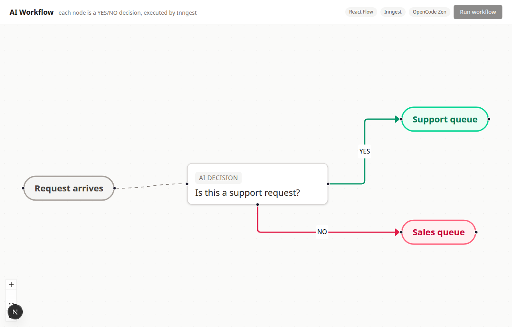

# Week 7 · BE-09 — Visual AI Workflow

A **visual AI workflow** tool: every node in the canvas is a **YES/NO AI decision**
(an LLM answers one question with only `YES` or `NO`), and the workflow is
executed by **Inngest** while the flow is built and visualised in **React Flow**.

This is Phase 1 (Setup) of a four-phase build — the scaffolding, wiring and
environment in which the flow editor (Phase 2) and the Inngest-executed AI graph
(Phase 3) will live.

## Phase status

| Phase | Goal | Status |
|-------|------|--------|
| 1 | Setup — app, React Flow, Inngest, OpenAI SDK, Shadcn, env, structure | ✅ **done (this commit)** |
| 2 | Foundations — visual flow editor, YES/NO edge types, editable prompts | ⏳ next |
| 3 | Build — every node → Inngest step, LLM returns YES/NO, dynamic traversal | ⏳ todo |
| 4 | Polish — ≥3 of: execution state, logs panel, save/load, export/import, styling, retries | ⏳ todo |

## Summary

- **Two parts, one repo**: a Next.js site (`site/`) renders the React Flow canvas;
  an Express + Inngest server (`src/`) is the workflow engine and exposes
  `/api/inngest` for the Dev Server to discover and run functions. Both share the
  repo-root dependencies (single hoisted install — the monorepo convention).
- **React Flow wired**: the canvas already renders a running two-branch graph —
  `Request arrives → "Is this a support request?"` with a **YES** edge to
  `Support queue` and a **NO** edge to `Sales queue`, the exact example shape the
  assignment describes.
- **Inngest alive**: the Dev Server discovers and runs an `engine-ping` function
  (event `workflow/ping` → `pong from the AI workflow engine`), proving the
  app ↔ Dev Server loop before any workflow logic exists.
- **Shadcn (light)**: Tailwind v4 + the `cn` helper + `Button` / `Card` UI
  primitives, so the UI is consistent without the full shadcn CLI.
- **LLM provider configured**: `openai` SDK + OpenCode Zen free tier (the lane
  already proven in this repo at week-6) — three env vars ready for Phase 3.

## Run it

From the repo root (monorepo scripts follow the `:be9` convention):

Terminal 1 — the API + Inngest function host (listens on port 3000):

```bash
npm run start:be9        # one-shot
npm run dev:be9          # watch mode
```

Terminal 2 — the Inngest Dev Server + dashboard:

```bash
npx inngest-cli@latest dev -u http://localhost:3000/api/inngest
# dashboard at http://localhost:8288
```

Terminal 3 — the frontend (React Flow editor, port 3001):

```bash
npm run dev:be9-site     # http://localhost:3001
npm run build:be9-site   # production build of the site
```

Proving the loop by hand — send `workflow/ping` and watch `engine-ping` run:

```bash
npm run start:be9
# (in another terminal) send the event, then check the dashboard run stream
INNGEST_DEV=1 npx tsx week-7/BE-09/src/test-ping.ts
```

Environment lives in `week-7/BE-09/.env` (copy `.env.example`), loaded explicitly
by `src/config.ts`. The LLM variables (`LLM_BASE_URL`, `LLM_API_KEY`,
`LLM_MODEL`) are consumed in Phase 3; the free tier needs an **empty** key (only
a non-empty key is signed onto the Authorization header).

## Endpoints

| Method | Path | Description | Status |
|--------|------|-------------|--------|
| GET | `/health` | Liveness probe | `200` |
| POST | `/api/inngest` | Inngest function discovery + execution (Dev Server) | — |

The discovery/execution surface grows in Phase 3 with the graph-execution routes.

## Verified live

```
GET /health                                HTTP 200  {"status":"ok"}
workflow/ping event sent                   id 01M0M6XSZ1YV4XQA1E5HPJRSFY
Dev Server: initializing fn engine-ping -> inngest/function.finished  (run completed)
site renders: 1 React Flow container, decision node rendered,
              header + YES/NO graph present (Playwright DOM check)
next build week-7/BE-09/site               Compiled + TypeScript passed (exit 0)
```

The React Flow canvas, rendered by the running dev server:

<div align="center">
  <figure style="margin:0;">
    
    <figcaption style="text-align:center; font-size:12px; opacity:.8;">
      Phase 1 health check: header, stack badges, disabled Run button, and the
      two-branch YES/NO decision graph on the React Flow canvas
    </figcaption>
  </figure>
</div>

## Tech stack

| Layer | Choice |
|-------|--------|
| Frontend | Next.js (App Router, `next dev`) + React + React Flow (`@xyflow/react`) |
| UI primitives | Shadcn-style: Tailwind v4, `cn` helper, `Button` / `Card` |
| Workflow engine | Inngest SDK + local Dev Server (dashboard :8288) |
| Web framework | Express (API + `serve` for `/api/inngest`) |
| LLM | `openai` SDK + OpenCode Zen free tier (Phase 3) |

## Project structure

```
week-7/BE-09/
├── README.md
├── task.md
├── .env.example            committed template; .env is git-ignored
├── src/                    the workflow engine (Express + Inngest)
│   ├── config.ts           dotenv loader (explicit path) + port
│   ├── server.ts           /health + /api/inngest (serve) + /api/inngest
│   ├── functions.ts        Inngest client + engine-ping (Phase-3 executor lands here)
│   └── test-ping.ts        Phase-1 checkpoint: sends workflow/ping
├── site/                   the Next.js frontend (React Flow editor)
│   ├── tsconfig.json / next.config.ts / postcss.config.mjs / next-env.d.ts
│   └── src/
│       ├── app/            layout.tsx, page.tsx, globals.css (Tailwind + React Flow)
│       ├── components/
│       │   ├── flow/FlowCanvas.tsx     two-branch YES/NO graph
│       │   └── ui/                     button.tsx, card.tsx (shadcn-light)
│       └── lib/utils.ts                cn() helper
└── data/evidence/          site-phase1.png
```

## Conclusion

Phase 1 proves the three moving parts of an AI workflow product actually talk to
each other on this machine before any business logic exists. The Next.js site
genuinely renders a React Flow graph of the assignment's own example — a request
routed by "Is this a support request?" down a YES or a NO edge. The Inngest Dev
Server discovers and completes a real function run over `/api/inngest`, so Phase 3
has its execution loop already warm. The only storage decision deferred is the
graph state itself (local, Phase 2); the only integration deferred is the model
call (Phase 3), whose provider and env vars are already configured.

The one lesson that carries forward from the wiring is the Inngest v4 shape this
monorepo settled on in BE-06: the trigger lives inside the options object, the
`express.json()` middleware must run before the `serve` adapter, and `INNGEST_DEV=1`
keeps the SDK in local mode. Reusing that verified pattern means Phase 3's
executor is a matter of adding steps to a function the loop already runs.
